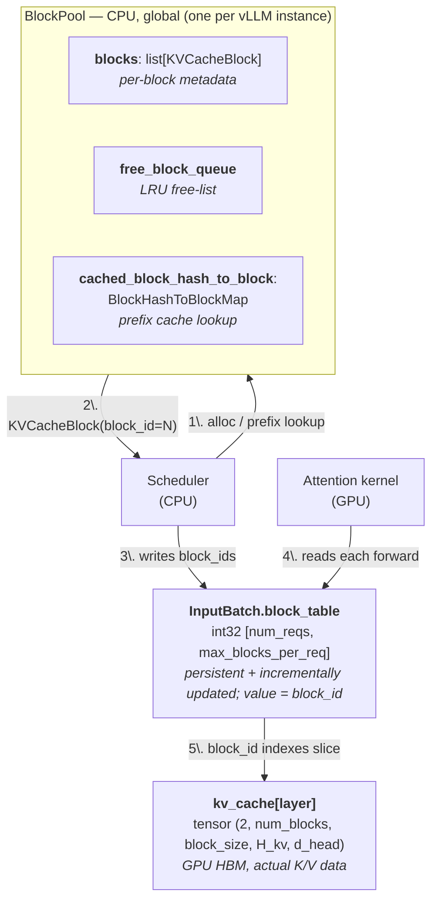

# vLLM KV Cache

Code links pinned to commit
[`33d7cbe`](https://github.com/vllm-project/vllm/tree/33d7cbe02ca100d3f0314cd22f4342d5cd23ba15).

## Why "KV" only

Standard causal self-attention in matrix form:

$$A = \mathrm{softmax}\!\left(\frac{QK^\top}{\sqrt{d}} + M\right) V$$

where $Q, K, V \in \mathbb{R}^{n \times d}$ (rows = tokens, cols = head dim), and
$M$ is the causal mask: $M_{ij} = 0$ for $j \le i$, else $-\infty$.

Row $i$ of $A$ is the output for token $i$. Since softmax acts row-wise and the
mask zeros out positions $j > i$:

$$a_i = \sum_{j=1}^{i} s_{ij}\, v_j, \qquad s_{ij} = \frac{\exp(q_i \cdot k_j / \sqrt{d})}{\sum_{j'=1}^{i} \exp(q_i \cdot k_{j'} / \sqrt{d})}$$

Two consequences:

- Past queries $q_{j' < i}$ never appear in any future $a_i$ — used once, then dead.
- Causal mask freezes $a_{1..n}$ when token $n+1$ is appended, so $k_j, v_j$ can
  be safely reused by every future $q_{i > j}$.

K, V written once, read many times. Q fresh per step. Hence "KV cache."

## Compute & memory

### Compute

Per layer, where $T$ = total sequence length the request reaches (prompt + generated;
not the model's `max_model_len`):

- **Projection** = computing $q, k, v$ from input via $W_Q, W_K, W_V$.
  Per token: $O(d^2)$ (matrix-vector multiply).
- **Attention** = the $\mathrm{softmax}(QK^\top)V$ itself. At step $t$:
  $q_t$ against $t$ keys/values → $O(t \cdot d)$.

| | Projection | Attention |
|---|---|---|
| No cache | $O(T^2 d^2)$  — re-project all $t$ tokens each step | $O(T^2 d)$ |
| KV cache | $O(T d^2)$  — project only the new token | $O(T^2 d)$ |

<details>
<summary>Derivation</summary>

Per-step cost at step $t$ (current length = $t$), summed over $T$ steps via
$\sum_{t=1}^{T} t = T(T+1)/2 \approx T^2/2$:

| | Per step | Sum over $T$ |
|---|---|---|
| Projection, no cache | $t \cdot d^2$ (re-project all $t$ tokens) | $O(T^2 d^2)$ |
| Projection, KV cache | $d^2$ (only the new token) | $O(T d^2)$ |
| Attention (either) | $t \cdot d$ ($q_t$ vs $t$ keys + weighted sum) | $O(T^2 d)$ |

The $T^2$ everywhere is the same $1+2+\cdots+T$ identity — linear-in-$t$ per
step → $T^2$ total; constant-in-$t$ → just $T$.

</details>

### Memory

Per layer, per cached token: $2 \cdot H_{kv} \cdot d_{head} \cdot \text{bytes}$ — the `2` is K + V.

$H_{kv}$ = number of KV heads (= $H$ for MHA, $< H$ for GQA / MQA).

<details>
<summary>Derivation</summary>

Each cached token holds, per layer, $H_{kv}$ K vectors and $H_{kv}$ V vectors
(one of each per KV head), each of dimension $d_{head}$, at `bytes` per element
(2 for bf16/fp16, 1 for fp8). Total elements per token per layer:
$2 \cdot H_{kv} \cdot d_{head}$.

Full request (length $L$, $N$ layers):
$N \cdot L \cdot 2 \cdot H_{kv} \cdot d_{head} \cdot \text{bytes}$.

*Example — Llama-3-70B at 8K context, bf16:*
$80 \cdot 8192 \cdot 2 \cdot 8 \cdot 128 \cdot 2$ ≈ 2.5 GB per request.

</details>

## Paged KV cache (PagedAttention)

vLLM's KV cache is **paged**, not contiguous — direct analog to OS virtual memory
(vLLM's core innovation,
[PagedAttention paper, SOSP'23](https://arxiv.org/abs/2309.06180)).

**Block** = fixed bundle of `block_size` tokens worth of K/V per layer (default
16; **token count, not bytes**). Llama-3-70B bf16 → one block =
`2·16·8·128·2` (K+V · block_size · H_kv · d_head · bytes) = 64 KB per layer.

### Architecture

Three layers connect via integer block identifiers, but **vLLM uses two
different identifiers — only one is named `block_id`**:

| Identifier | What it is | Range | Named? |
|---|---|---|---|
| **Physical `block_id`** | index into `kv_cache`'s `num_blocks` dim | `0 ~ num_gpu_blocks-1` | yes — vLLM calls this `block_id` |
| **Logical position `j`** | which block of a request (the column in `block_table[req, j]`) | `0 ~ (request's current block count - 1)` | no — just a positional index, never called `block_id` in code |

`block_table[req, j] = block_id` maps logical → physical. Throughout this doc,
**when you see `block_id` it means the physical one**.

- **[`BlockPool`](https://github.com/vllm-project/vllm/blob/33d7cbe02ca100d3f0314cd22f4342d5cd23ba15/vllm/v1/core/block_pool.py#L130)**
  (CPU, global) — owns per-block metadata:
  [`KVCacheBlock` array](https://github.com/vllm-project/vllm/blob/33d7cbe02ca100d3f0314cd22f4342d5cd23ba15/vllm/v1/core/block_pool.py#L162-L164),
  [LRU free-list](https://github.com/vllm-project/vllm/blob/33d7cbe02ca100d3f0314cd22f4342d5cd23ba15/vllm/v1/core/block_pool.py#L168),
  and [`BlockHashToBlockMap`](https://github.com/vllm-project/vllm/blob/33d7cbe02ca100d3f0314cd22f4342d5cd23ba15/vllm/v1/core/block_pool.py#L171)
  for prefix-cache lookup.
- **[`InputBatch.block_table`](https://github.com/vllm-project/vllm/blob/33d7cbe02ca100d3f0314cd22f4342d5cd23ba15/vllm/v1/worker/gpu_input_batch.py#L171)**
  (CPU+GPU, persistent) — `int32 [num_reqs, max_blocks_per_req]`; row = request,
  column = logical block position `j`, value = physical `block_id`. Lives across
  steps and is **incrementally updated** (new request → `add_row`; new block →
  `append_row`; finished request → `clear_row`); GPU copy synced before each
  forward. (Analog of an OS page table: column = virtual page, value = physical
  frame.)
- **[`kv_cache[layer]`](https://github.com/vllm-project/vllm/blob/33d7cbe02ca100d3f0314cd22f4342d5cd23ba15/vllm/v1/worker/gpu_model_runner.py#L7052)**
  (GPU HBM) — actual K/V tensor, shape `(2, num_blocks, block_size, H_kv, d_head)`,
  indexed by physical `block_id`.



**Request lifecycle** (end-to-end):

1. Request arrives. Scheduler chunks the prompt into `block_size`-token logical
   blocks, computes each block's chained hash, and
   [probes `BlockHashToBlockMap`](https://github.com/vllm-project/vllm/blob/33d7cbe02ca100d3f0314cd22f4342d5cd23ba15/vllm/v1/core/single_type_kv_cache_manager.py#L373)
   for prefix hits; every hit gets `ref_cnt += 1`.
2. For the un-hit blocks, scheduler calls
   [`BlockPool.get_new_blocks`](https://github.com/vllm-project/vllm/blob/33d7cbe02ca100d3f0314cd22f4342d5cd23ba15/vllm/v1/core/block_pool.py#L333),
   which pops fresh `KVCacheBlock`s from the LRU free-list.
3. Scheduler
   [writes](https://github.com/vllm-project/vllm/blob/33d7cbe02ca100d3f0314cd22f4342d5cd23ba15/vllm/v1/worker/gpu_model_runner.py#L1392)
   all selected `block_id`s into the request's
   [row of `block_table`](https://github.com/vllm-project/vllm/blob/33d7cbe02ca100d3f0314cd22f4342d5cd23ba15/vllm/v1/worker/block_table.py#L102-L118).
4. Each forward step: scheduler derives `slot_mapping` (per-token physical write
   positions) from `block_table`; backend calls
   [`reshape_and_cache_flash`](https://github.com/vllm-project/vllm/blob/33d7cbe02ca100d3f0314cd22f4342d5cd23ba15/vllm/_custom_ops.py#L2621)
   → CUDA kernel
   [`reshape_and_cache_flash_kernel`](https://github.com/vllm-project/vllm/blob/33d7cbe02ca100d3f0314cd22f4342d5cd23ba15/csrc/cache_kernels.cu#L304)
   scatters new K/V into `kv_cache[layer]` at `slot_mapping` positions.
5. Attention kernel
   [reads `block_table`](https://github.com/vllm-project/vllm/blob/33d7cbe02ca100d3f0314cd22f4342d5cd23ba15/vllm/v1/attention/backends/flash_attn.py#L809)
   to find physical block ids,
   [fetches](https://github.com/vllm-project/vllm/blob/33d7cbe02ca100d3f0314cd22f4342d5cd23ba15/vllm/v1/attention/backends/flash_attn.py#L798-L799)
   historical K/V from `kv_cache[layer]` (kernel does the paged indexing via
   [`block_table`](https://github.com/vllm-project/flash-attention/blob/d0a0e2bf2113fcfd0336e5dd201a5fd89b297a8f/csrc/flash_attn/src/flash_fwd_kernel.h#L632-L638)),
   and
   [runs](https://github.com/vllm-project/vllm/blob/33d7cbe02ca100d3f0314cd22f4342d5cd23ba15/vllm/v1/attention/backends/flash_attn.py#L796)
   attention →
   [`flash_attn_varlen_func`](https://github.com/vllm-project/flash-attention/blob/d0a0e2bf2113fcfd0336e5dd201a5fd89b297a8f/vllm_flash_attn/flash_attn_interface.py#L136)
   →
   [`mha_varlen_fwd`](https://github.com/vllm-project/flash-attention/blob/d0a0e2bf2113fcfd0336e5dd201a5fd89b297a8f/csrc/flash_attn/flash_api.cpp#L516)
   (C++ host in `vllm-flash-attn` fork, takes `block_table` arg and launches the
   paged CUDA kernel).
6. When a block fills up, scheduler
   [registers it](https://github.com/vllm-project/vllm/blob/33d7cbe02ca100d3f0314cd22f4342d5cd23ba15/vllm/v1/core/block_pool.py#L211)
   in `BlockHashToBlockMap` so future requests can share. Request completes:
   `ref_cnt -= 1`; blocks at `ref_cnt = 0` rejoin the free-list (hash entry kept
   until the block is evicted for reuse).

The sections below drill into the two non-obvious mechanisms: **prefix sharing**
(how step 1's hash matching works) and **slot_mapping** (how step 4's write
addresses are derived).

### Prefix sharing

Two different requests with the same prompt prefix should reuse the same
physical blocks (the whole point of `BlockHashToBlockMap`). Sharing is detected
via **chained block hash** (Merkle-style):
`h_k = sha256((h_{k-1}, tokens_k, extras))`. On request arrival, the scheduler
computes the hash chain and probes `BlockHashToBlockMap` block-by-block; **first
miss stops** the scan, every hit before gets `ref_cnt += 1` and fills the new
request's `block_table`. `extras` covers LoRA name / multimodal hash / cache
salt → same tokens with different context = different hash = no false sharing.

### Two index structures, two access patterns

With prefix sharing in mind, the two structures from the diagram split cleanly:

| | `block_table` (field of `InputBatch`) | `BlockHashToBlockMap` (field of `BlockPool`) |
|---|---|---|
| Scope | per-request | global (one per vLLM instance) |
| Shape | flat 2D `int32` `[num_reqs, max_blocks_per_req]` | `dict[BlockHash, KVCacheBlock]` |
| Lookup key | logical block idx (`int`) | chained block hash (32 bytes) |
| Read by | **kernel** every forward (gather K/V) | **scheduler** at request arrival (prefix lookup) |
| Frequency | each token × each layer | once per new request |

### Slot mapping (write path)

**`slot_mapping`** (per-token, recomputed each step) = flattened
`block_id * block_size + offset_in_block`, derived from `block_table`. Consumed
by [`reshape_and_cache_flash`](https://github.com/vllm-project/vllm/blob/33d7cbe02ca100d3f0314cd22f4342d5cd23ba15/vllm/_custom_ops.py#L2621)
to scatter writes into `kv_cache[layer]`.

### vs contiguous cache

Continuous KV cache (one max-length slab per request) had GPU mem utilization
~30%. Paging brings it to ~90%+: no internal fragmentation beyond
`block_size − 1` tokens, no over-allocation, prefix sharing free. Trade-off:
attention kernels must be "paged-aware" (why vLLM maintains the
[`vllm-flash-attn`](https://github.com/vllm-project/flash-attention) fork —
adds `block_table` support to upstream FlashAttention).

## Model layer — symmetric Q/K/V handoff

[`vllm/model_executor/models/llama.py:228-231`](https://github.com/vllm-project/vllm/blob/33d7cbe02ca100d3f0314cd22f4342d5cd23ba15/vllm/model_executor/models/llama.py#L228-L231)

```python
qkv, _ = self.qkv_proj(hidden_states)
q, k, v = qkv.split([self.q_size, self.kv_size, self.kv_size], dim=-1)
q, k = self.rotary_emb(positions, q, k)
attn_output = self.attn(q, k, v)
```

Model layer is cache-agnostic: splits the fused QKV projection and hands all
three to `self.attn`. For GQA models (Llama-3, Qwen, etc.),
`kv_size = H_kv · d_head` with $H_{kv} < H$ → KV cache is $H / H_{kv}$ × smaller
than full MHA.

## Dispatch layer — where Q is dropped

[`vllm/model_executor/layers/attention/attention.py:498-507`](https://github.com/vllm-project/vllm/blob/33d7cbe02ca100d3f0314cd22f4342d5cd23ba15/vllm/model_executor/layers/attention/attention.py#L498-L507)

```python
kv_cache_dummy_dep = unified_kv_cache_update(
    key, value, self.layer_name        # ← no query
)
unified_attention_with_output(
    query, key, value, output, self.layer_name,
    kv_cache_dummy_dep=kv_cache_dummy_dep,
)
```

[`unified_kv_cache_update`](https://github.com/vllm-project/vllm/blob/33d7cbe02ca100d3f0314cd22f4342d5cd23ba15/vllm/model_executor/layers/attention/attention.py#L691)
is a torch custom op (registered under the `torch.ops.vllm` namespace) that
dispatches to the backend's
[`do_kv_cache_update`](https://github.com/vllm-project/vllm/blob/33d7cbe02ca100d3f0314cd22f4342d5cd23ba15/vllm/v1/attention/backends/flash_attn.py#L850).
The
[dummy tensor it returns](https://github.com/vllm-project/vllm/blob/33d7cbe02ca100d3f0314cd22f4342d5cd23ba15/vllm/model_executor/layers/attention/attention.py#L714)
(an empty `torch.empty(0, ...)`) is a fake data dep — passed as
`kv_cache_dummy_dep` to
[`unified_attention_with_output`](https://github.com/vllm-project/vllm/blob/33d7cbe02ca100d3f0314cd22f4342d5cd23ba15/vllm/model_executor/layers/attention/attention.py#L734)
so `torch.compile`
[preserves WRITE-before-READ order](https://github.com/vllm-project/vllm/blob/33d7cbe02ca100d3f0314cd22f4342d5cd23ba15/vllm/model_executor/layers/attention/attention.py#L744-L747).
Some backends fold the write into
[`impl.forward`](https://github.com/vllm-project/vllm/blob/33d7cbe02ca100d3f0314cd22f4342d5cd23ba15/vllm/v1/attention/backends/flash_attn.py#L667)
directly (guarded by
[`forward_includes_kv_cache_update`](https://github.com/vllm-project/vllm/blob/33d7cbe02ca100d3f0314cd22f4342d5cd23ba15/vllm/v1/attention/backend.py#L66)).
`impl` here is the
backend's worker instance (`FlashAttentionImpl` etc.) constructed from
[`backend.get_impl_cls()`](https://github.com/vllm-project/vllm/blob/33d7cbe02ca100d3f0314cd22f4342d5cd23ba15/vllm/v1/attention/backends/flash_attn.py#L132).

## Backend layer — actual memory write & read

Cache layout: `(2, num_blocks, block_size, H_kv, d_head)`. `unbind(0)` splits
into `key_cache` and `value_cache` — no slot for Q.

**Write** ([flash_attn.py:850-883](https://github.com/vllm-project/vllm/blob/33d7cbe02ca100d3f0314cd22f4342d5cd23ba15/vllm/v1/attention/backends/flash_attn.py#L850-L883)):

```python
def do_kv_cache_update(self, layer, key, value, kv_cache, slot_mapping):
    key_cache, value_cache = kv_cache.unbind(0)   # 2 = K + V
    reshape_and_cache_flash(
        key, value, key_cache, value_cache,
        slot_mapping, self.kv_cache_dtype, ...
    )
```

**Read** ([flash_attn.py:796-818](https://github.com/vllm-project/vllm/blob/33d7cbe02ca100d3f0314cd22f4342d5cd23ba15/vllm/v1/attention/backends/flash_attn.py#L796-L818)):

```python
flash_attn_varlen_func(
    q=query[:num_actual_tokens],   # current step only
    k=key_cache,                   # ← reads entire paged cache
    v=value_cache,
    cu_seqlens_q=cu_seqlens_q,
    seqused_k=seqused_k,           # per-request valid K length
    block_table=block_table,       # logical→physical block mapping
    causal=attn_metadata.causal,
    ...
)
```

## Backend selection at runtime

Runs once per layer at `Attention.__init__`, cached via `@cache`.

1. [`selector.py:52`](https://github.com/vllm-project/vllm/blob/33d7cbe02ca100d3f0314cd22f4342d5cd23ba15/vllm/v1/attention/selector.py#L52)
   dispatches to `current_platform.get_attn_backend_cls()`. Each platform
   has its own implementation:
   [CUDA](https://github.com/vllm-project/vllm/blob/33d7cbe02ca100d3f0314cd22f4342d5cd23ba15/vllm/platforms/cuda.py#L293),
   [ROCm](https://github.com/vllm-project/vllm/blob/33d7cbe02ca100d3f0314cd22f4342d5cd23ba15/vllm/platforms/rocm.py#L482),
   [CPU](https://github.com/vllm-project/vllm/blob/33d7cbe02ca100d3f0314cd22f4342d5cd23ba15/vllm/platforms/cpu.py#L75),
   [XPU](https://github.com/vllm-project/vllm/blob/33d7cbe02ca100d3f0314cd22f4342d5cd23ba15/vllm/platforms/xpu.py#L50).
2. On CUDA: enumerate a hardcoded
   [priority list](https://github.com/vllm-project/vllm/blob/33d7cbe02ca100d3f0314cd22f4342d5cd23ba15/vllm/platforms/cuda.py#L79-L147)
   (varies by `use_mla` / device capability).
3. For each candidate, call `validate_configuration(device_capability,
   head_size, dtype, kv_cache_dtype, block_size, use_mla, ...)` — declared in
   [`registry.py`](https://github.com/vllm-project/vllm/blob/33d7cbe02ca100d3f0314cd22f4342d5cd23ba15/vllm/v1/attention/backends/registry.py#L34).
4. [Lowest-priority-index valid one wins](https://github.com/vllm-project/vllm/blob/33d7cbe02ca100d3f0314cd22f4342d5cd23ba15/vllm/platforms/cuda.py#L349-L354).

## Block-level code map (v1 engine)

| Component | File | Role |
|---|---|---|
| `KVCacheManager` | [`kv_cache_manager.py:110`](https://github.com/vllm-project/vllm/blob/33d7cbe02ca100d3f0314cd22f4342d5cd23ba15/vllm/v1/core/kv_cache_manager.py#L110) | Top-level alloc / free |
| `KVCacheCoordinator` | [`kv_cache_coordinator.py:28`](https://github.com/vllm-project/vllm/blob/33d7cbe02ca100d3f0314cd22f4342d5cd23ba15/vllm/v1/core/kv_cache_coordinator.py#L28) | Multi-type coordination (Unitary / Hybrid) |
| `BlockPool` | [`block_pool.py:130`](https://github.com/vllm-project/vllm/blob/33d7cbe02ca100d3f0314cd22f4342d5cd23ba15/vllm/v1/core/block_pool.py#L130) | Physical pool, LRU eviction |
| `KVCacheBlock`, `FreeKVCacheBlockQueue` | [`kv_cache_utils.py:116`](https://github.com/vllm-project/vllm/blob/33d7cbe02ca100d3f0314cd22f4342d5cd23ba15/vllm/v1/core/kv_cache_utils.py#L116) | Per-block metadata + free-list |
| `KVCacheSpec`, `AttentionSpec` | [`kv_cache_interface.py:95`](https://github.com/vllm-project/vllm/blob/33d7cbe02ca100d3f0314cd22f4342d5cd23ba15/vllm/v1/kv_cache_interface.py#L95) | `page_size_bytes = 2 * block_size * H_kv * d_head * dtype` |
| `BlockHashToBlockMap` | [`block_pool.py:34`](https://github.com/vllm-project/vllm/blob/33d7cbe02ca100d3f0314cd22f4342d5cd23ba15/vllm/v1/core/block_pool.py#L34) | Prefix-cache hash table |
| `get_block_hash`, `find_longest_cache_hit` | [`kv_cache_utils.py:42`](https://github.com/vllm-project/vllm/blob/33d7cbe02ca100d3f0314cd22f4342d5cd23ba15/vllm/v1/core/kv_cache_utils.py#L42), [`single_type_kv_cache_manager.py:373`](https://github.com/vllm-project/vllm/blob/33d7cbe02ca100d3f0314cd22f4342d5cd23ba15/vllm/v1/core/single_type_kv_cache_manager.py#L373) | Hashing + longest-prefix match |

## Call chain summary

```
Model.forward
  └─ LlamaAttention.forward                              llama.py:223
       └─ self.attn(q, k, v)
            └─ Attention.forward                         attention.py:437
                 ├─ unified_kv_cache_update(k, v)        attention.py:691
                 │    └─ impl.do_kv_cache_update         flash_attn.py:850
                 │         └─ reshape_and_cache_flash    (CUDA kernel: write)
                 └─ unified_attention_with_output(q,k,v) attention.py:734
                      └─ impl.forward                    flash_attn.py:667
                           └─ flash_attn_varlen_func     (CUDA kernel: read+attend)
```
