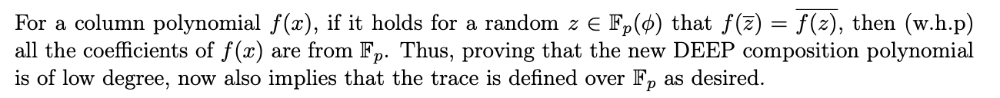
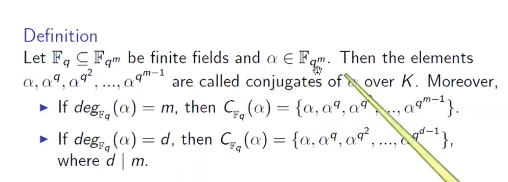

# Introduction

This is the 1st post of a series of notes in understanding the [stark](https://eprint.iacr.org/2021/582.pdf) protocol.

Only tricky parts will be mentioned, one at a time.

In this post, we'll demystify this statement:

# Background

First we need to understand the concept of conjugates in finite field:

The $deg_{F_q}(α)$ means the degree of the [minimal polynomial](https://en.wikipedia.org/wiki/Minimal_polynomial_(field_theory)) of $α$ over $F_q$.

There's a lot of implied information in the definition itself:
1. For an element of ${F_q}(α)$, the number of conjugates over $F_q$ equals to the degree of its minimal polynomial over $F_q$.
   1. It implies each $α^{q^i}$ is different for $i\in [0, deg_{F_q}(α))$
      1. Otherwise if $α^{q^i} = α^{q^j}$, we can deduce $α^{q^{i-j}}=α$, thus $a \in F_{q^{i-j}} \subset F_q(α)$, which is contradiction.
   2. This is also why finite extension over finite field is always galois extension, since all conjugates can be obtained this way and extension over finite field is always splitable[^1].
2. Within $F_q(α)$, the degree of the minimal polynomial of an arbitrary element over $F_q$ is a factor of $deg_{F_q}(α)$.
3. The conjugates can be calculated by iterating [Frobenius Automorphism](https://mathworld.wolfram.com/FrobeniusAutomorphism.html).
   1. It's easy to see $f(x)=x^q$ is Automorphism over ${F_q}(α)$, so is $f^n(x)$ by induction.

# Principle

Now we're ready to understand the statement at the beginning.

$$

\begin{align*}
& \forall z \in F_p(α), \overline{z} = z^p\\
& ∵  \overline{f(x)} = f(\overline{x}) \\

& \begin{align*} \;∴ \overline{f(x)} & = \overline{\sum_{i=0}^{i=n} a_i x^i} \\
                   & = \begin{equation}\sum_{i=0}^{i=n} \overline{a_i} \overline{x^i}\;\;\;\; \tag{It's a property of Automorphism, conjugation is Automorphism}\end{equation}\\
                   & = f(\overline{x}) \\
                   & = \begin{equation}\sum_{i=0}^{i=n} a_i \overline{x^i} \;\;\;\; \tag{2} \end{equation}\\
      \end{align*}\\
& ∴ \forall i\in [0, n], a_i = \overline{a_i} \\

& ∴ \forall i\in [0, n], a_i = a_i^p\\
& ∴ \forall i\in [0, n], a_i \in Split(x^p-x) ≅ F_p\\
& ∴ \forall i\in [0, n], a_i \in F_p\\

\end{align*}

$$

[^1]: If Char F = p > 0, irreducible polynomial f(x) over F has repeated root iff there exists $g(x) \in F[x] s.t. f(x)=g(x^p)$. So if there's an extension over F that's not splitable, there must exist an element $a$ whose minimal polynomial is $g(x^p), g(x) \in F[x]$, but $g(x^p)=g(x)^p$ which is not irreducible polynomial.
