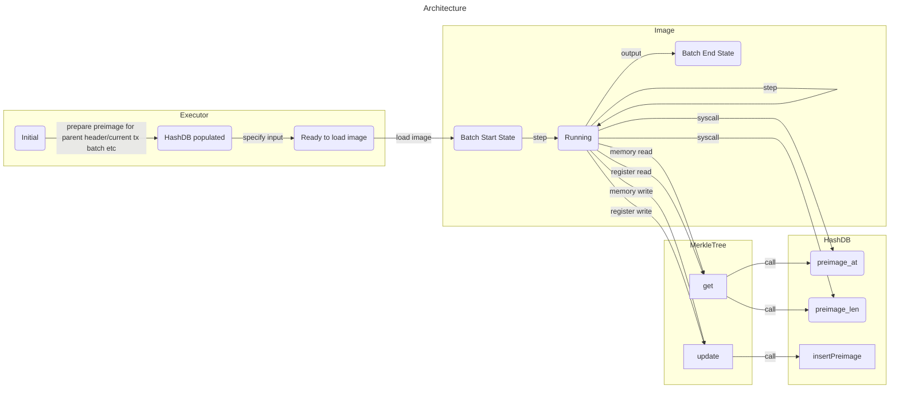

# Introduction

[Goshen protocol](https://testnet-alpha.goshen.network/goshen_white_paper.pdf) is an interesting optimistic rollup protocol based on riscv isa. Its core idea is:
1. Encode the machine state into a merkle tree.
2. Offload the machine state to external virtual disk simulated by [`HashDB`](https://github.com/goshennetwork/rollup-contracts/blob/3436fe36243511826245ce45195259d90289264f/contracts/libraries/HashDB.sol).

# Principle

The machine state contains:
1. Memory state
2. Register state
3. Input/output hash

Basically goshen protocol is using the merkle tree as key value database:
1. Each aligned memory word is encoded as a leaf of the merkle tree, using the pointer(which is also `word size`) as path. ([Reference Impl](https://github.com/goshennetwork/rollup-contracts/blob/3436fe36243511826245ce45195259d90289264f/contracts/state-machine/Memory.sol#L18))
2. Each register is encoded as a leaf of the merkle tree, using register id(which is only a `single byte`) as path. ([Reference Impl](https://github.com/goshennetwork/rollup-contracts/blob/3436fe36243511826245ce45195259d90289264f/contracts/state-machine/riscv32/Register.sol#L90))
3. Input/output hash are encoded as a leaf of the merkle tree, using `0xfe`/`0xff` as path.

Thus a deterministical machine state root can be calculated after each instruction. If we only consider cases where the entire state can be put into memory/register, these primitives are already enough to bootstrap an optimistic rollup protocol.

In order to make it also work for cases where the entire state is too big to fit into limited memory/register, there has to be an abstraction for external disk.

It turns out the `HashDB` abstraction fits pretty well as an external disk for merkle tree:

```rust
pub fn preimage_at(hash: *const u8, offset : usize) −> u32;
pub fn preimage_len(hash: *const u8) −> usize;
pub fn insert_preimage(preimage: *const u8, size: usize);
```

1. `preimage_at` and `preimage_len` are [called](https://github.com/goshennetwork/rollup-contracts/blob/3436fe36243511826245ce45195259d90289264f/contracts/state-machine/riscv32/Interpretor.sol#L309-L321) using riscv ecall
2. `insert_preimage` are called within merkle tree implementation and the offchain executor.
    1. Within merkle tree:
        1. When [inserting](https://github.com/goshennetwork/rollup-contracts/blob/3436fe36243511826245ce45195259d90289264f/contracts/libraries/MerkleTrie.sol#L66) the very first node.
        2. When [updating](https://github.com/goshennetwork/rollup-contracts/blob/3436fe36243511826245ce45195259d90289264f/contracts/libraries/MerkleTrie.sol#L459) the root.
        3. When the node length [larger](https://github.com/goshennetwork/rollup-contracts/blob/3436fe36243511826245ce45195259d90289264f/contracts/libraries/MerkleTrie.sol#L545) than 32 bytes.
    2. Within the offchain executor:
        1. not opensourced yet


The whole stack looks like below:



# Components

1. [Image](https://github.com/goshennetwork/goshen-chain/blob/629e2d341dab3e478a7e6f5ca841f4792ce750aa/bin/riscv/src/main.rs)
2. [Rollup contracts](https://github.com/goshennetwork/rollup-contracts)
3. Offchain executor(elf loader etc, not opensourced yet)