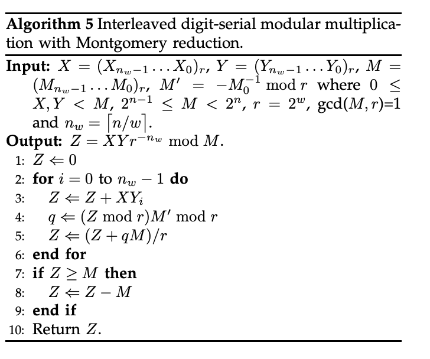

# Introduction

Previously we've introduced the Montgomery reduction [here](./montgomery_modular_arithmetic.md#the-redc-algorithm), which is applied after normal multiplication.

To make the process more efficient, interleaved Montgomery reduction and multiplication can be performed.

# The algorithm

# Principle

First let's prove that `Z + qM` inside the loop(`L2~L6`) is a multiple of `r`:

$$Z+qM \equiv Z + (((Z \pmod{r})M^{'}) \pmod{r})M \equiv Z + ZM^{'}M \equiv Z - Z \equiv 0 \pmod{r}$$

Then let's prove that $(Z+qM)/r$ is congruent to $Zr^{-1}\pmod{M}$:

$$(Z+qM)/r \equiv (Z+qM)r^{-1} \equiv Zr^{-1} + qr^{-1}M \equiv Zr^{-1}\pmod{M}$$

By induction, we can see the final $Z$ after the loop is congruent to:

$$ \sum_{i=0}^{i=n_{w}-1}XY_ir^{-(n_{w}-i)} \equiv r^{-n_{w}}\sum_{i=0}^{i=n_{w}-1}XY_ir^i \equiv XYr^{-n_{w}}\pmod{M}$$

Finally, let's prove that the `Z < 2M` is always true by induction:

When `i=0`, it trivially holds.

Suppose `Z < 2M` holds for `i=k`.

When `i=k+1`:

$$(Z+qM)/r = Z/r + qM/r < Z/r + M < 2M/r + M < 2M$$

This concludes the final `if` branch(`L7~L9`).

# Implementation

[Here](https://github.com/supranational/sppark/blob/07d73f7b0439c1239f239417b0b7b1cf250ad803/ff/mont_t.cuh#L403-L417) is an implementation from supranational.

The implementation differs from the above algorithm only in two aspects:
1. The result $XY_i$ is stored as two radix-r integers, each with $n_w$ digits, named `even` and `odd` respectively;
   1. The integer `even` is obtained from pointwise multiplication of $X$ with its odd-indexed digits all zeroed out and $Y_i$.
   2. The integer `odd` is obtained from pointwise multiplication of $X$ with its even-indexed digits all zeroed out and $Y_i$.
   3. This holds: $XY_i = even + odd \times r$
2. It processes 2 digits in each loop instead of 1 digit above.
   1. When processing the 2nd digit in the loop, the semantic of `even` and `odd` alternates:
      1. That is why `even` and `odd` are reversed [here](https://github.com/supranational/sppark/blob/07d73f7b0439c1239f239417b0b7b1cf250ad803/ff/mont_t.cuh#L408).
      2. As $n_w$ is even, finally `odd` is effectively even and `even` is effectively odd, that's why the lowest digit of `odd` is ignore [here](https://github.com/supranational/sppark/blob/07d73f7b0439c1239f239417b0b7b1cf250ad803/ff/mont_t.cuh#L412).

# References

1. https://homes.esat.kuleuven.be/~fvercaut/papers/bar_mont.pdf
2. https://eprint.iacr.org/2017/1057.pdf