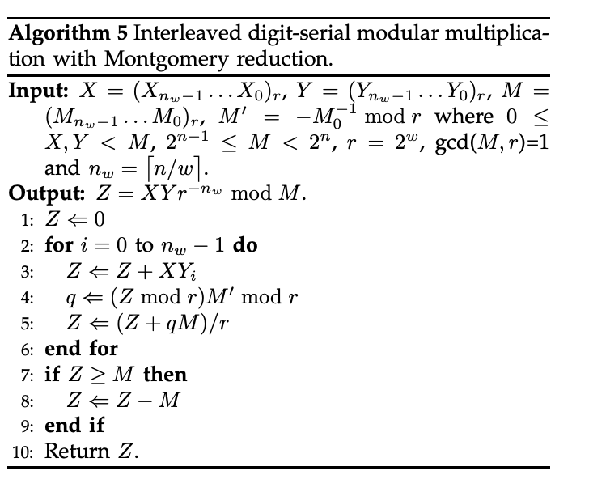

# Introduction

Previously we've introduced the Montgomery reduction [here](./montgomery_modular_arithmetic.md#the-redc-algorithm), which is applied after normal multiplication.

To make the process more efficient, interleaved Montgomery reduction and multiplication can be performed.

# The algorithm

# Principle

First let's prove that `Z + qM` inside the loop(`L2~L6`) is a multiple of `r`:

$$Z+qM \equiv Z + (((Z \pmod{r})M^{'}) \pmod{r})M \equiv Z + ZM^{'}M \equiv Z - Z \equiv 0 \pmod{r}$$

Then let's prove that $(Z+qM)/r$ is congruent to $Zr^{-1}\pmod{M}$:

$$(Z+qM)/r \equiv (Z+qM)r^{-1} \equiv Zr^{-1} + qr^{-1}M \equiv Zr^{-1}\pmod{M}$$

By induction, we can see the final $Z$ after the loop is congruent to:

$$ \sum_{i=0}^{i=n_{w}-1}XY_ir^{-(n_{w}-i)} \equiv r^{-n_{w}}\sum_{i=0}^{i=n_{w}-1}XY_ir^i \equiv XYr^{-n_{w}}\pmod{M}$$

Finally, let's prove that the `Z < 2M` is always true by induction:

When `i=0`, it trivially holds.

Suppose `Z < 2M` holds for `i=k`.

When `i=k+1`:

$$(Z+qM)/r = Z/r + qM/r < Z/r + M < 2M/r + M < 2M$$

This concludes the final `if` branch(`L7~L9`).

# References

1. https://homes.esat.kuleuven.be/~fvercaut/papers/bar_mont.pdf
2. https://eprint.iacr.org/2017/1057.pdf