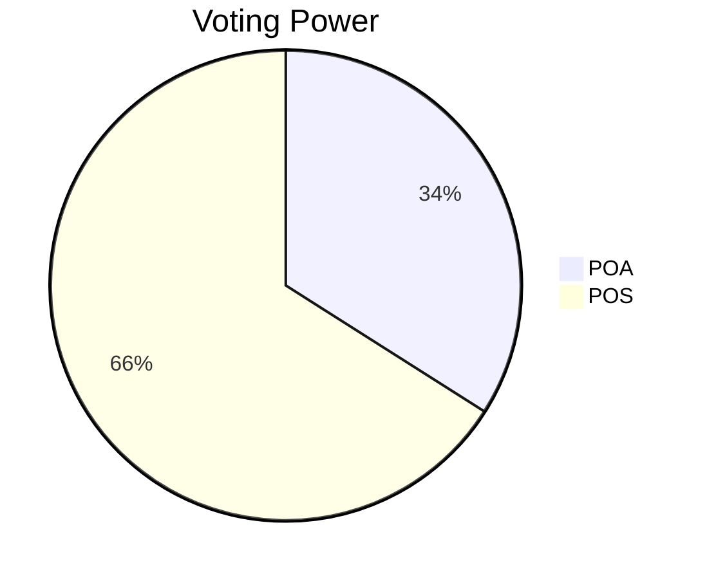
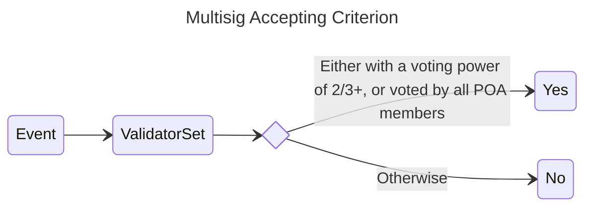
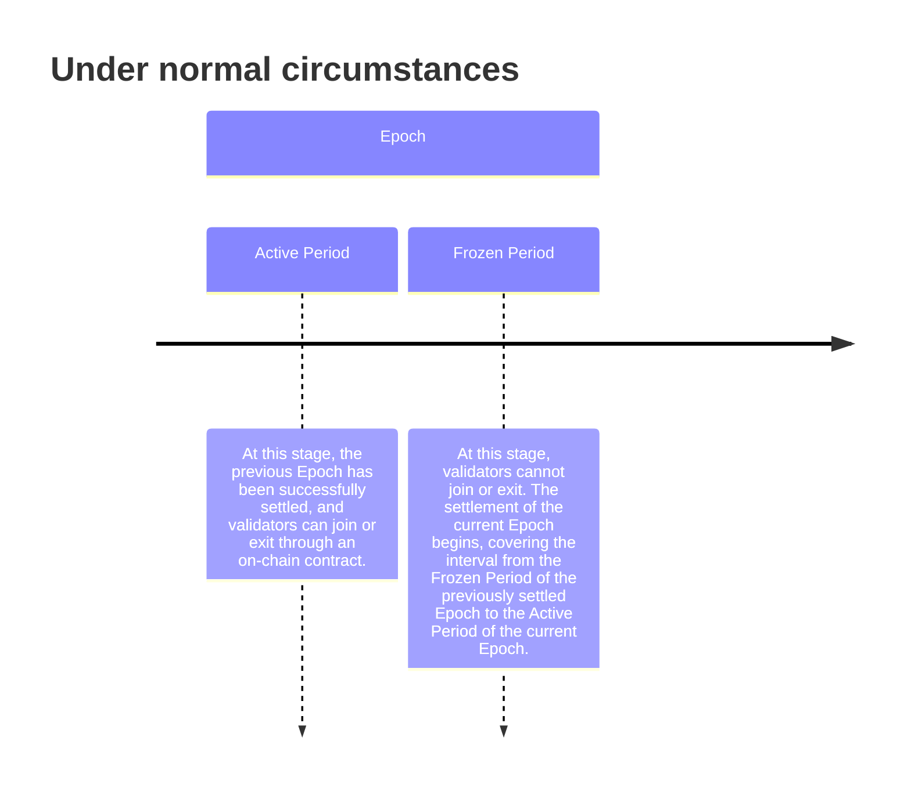
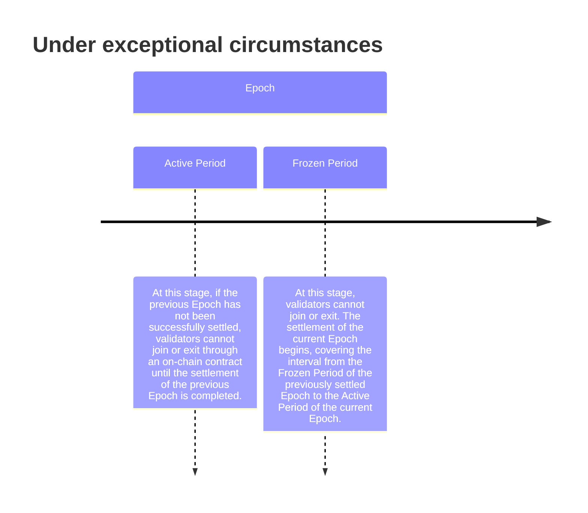
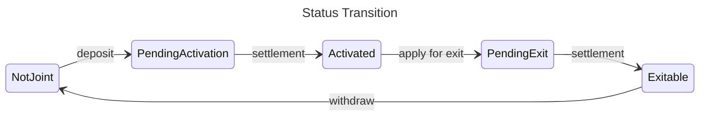
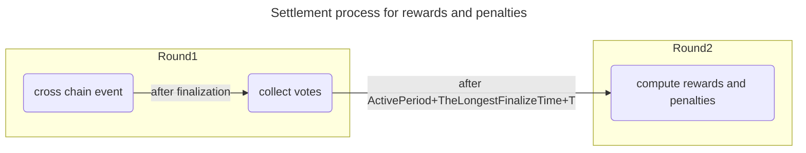

# Introduction

[IZAR bridge](https://izar.xyz/) is a trial of decentralized bridge harnessing zkSNARK and a novel governance scheme. 

Most existing bridges are either very centralized, or claiming to be decentralized by using MPC for signatures. Every participator holds a keyshare, and each time new participators join the system, all existing keyshares have to be regenerated. The problem is that the old keyshares are still effective, there's no way to revoke the old keyshares, which may pose significant security risks to the system. They mitigate this problem by transfering assets to another fresh address every few months, but this is coordinated manually, a process far from decentralization.

IZAR bridge tries to replace the MPC part with zkSNARK. Furthermore, IZAR bridge also employs a POS+POA hybrid consensus mechanism to ensure both security and decentralization.

# Design Rationale

To be decentralized, IZAR bridge first employs the POS (Proof of Stake) mechanism to allow permissionless participation for external validators. However, to prevent malicious validators from gaining control of 2/3+ of the voting power at a low cost during the initial stage, the system also introduces the POA (Proof of Authority) mechanism. Through a deterministic algorithm, it ensures that 1/3+ of the voting power is allocated to POA, thus leaving POS with 2/3- of the voting power.

In this way, even if all members of POS are malicious, as long as the members of POA act in good faith, the system remains secure. The inclusion of POA is permissioned, and only well-recognized teams within the industry will be allowed to join.

However, there is still a possibility of the system becoming inactive. To address this concern, the system has adjusted its multisig accepting criterion to be: either with a voting power of 2/3+, or voted by all POA members.

This concludes the rationale for hybrid POS+POA consensus.

Another aspect to concern is the gas cost of onchain verification. 

Traditionally most projects have chosen to use MPC to reduce gas cost. However, due to the aforementioned drawbacks, IZAR bridge has opted to use zkSNARK to address this problem.

# Protocol

There're mainly 3 parts in this protocol:

    1. POS+POA: consensus and governance
    2. zkSNARK: multisig verification
    3. Tokenomics: incentives for the system 

## POS+POA

The basic model is that time is divided into multiple periods, and each period has a predetermined validator set responsible for confirming cross-chain events and the entry and exit of validators. Under normal circumstances, prior to the end of an period, the validator set for the next period is settled, thereby achieving a smooth transition. Each period lasts approximately 2 weeks and is called an `Epoch`. 

In order to avoid changes in the validator set while settlement is taking place, each `Epoch` is further divided into an `Active Period` at the beginning and a `Frozen Period` at the end. The `Frozen Period` lasts approximately 1 day, during which no validator entry or exit are allowed on the blockchain. Additionally, settlement is conducted for the interval [`the_Frozen_Period_of_the_previously_settled_Epoch`, `the_Active_Period_of_the_current_Epoch`], which is called the `settlement range`.

In the event of exceptional circumstances where settlement is not successfully completed during the `Frozen Period`, the settlement process will be extended to the `Active Period` of the next `Epoch`. During this period, no validator additions or exits will be accepted until the settlement is finalized. In other words, there is always a principle followed that at any given moment, either the settlement phase or the mutable phase is active, but they do not occur in parallel.

Next, let's focus on describing the settlement process.

The input for the settlement process consists of the events of validator entry and exit, as well as cross-chain events that occur within the `settlement range` on the blockchain. 
The output of the settlement process is the balance and status of each validator.

In order to ensure the determinism of the settlement process, the rules are as follows:

1. Calculate the principal and status of POS validators based on on-chain events of validator entry and exit.
    1. Validator status includes: `NotJoint`, `PendingActivation`, `Activated`, `PendingExit`, and `Exitable`.
    2. Status transition:
        1. `NotJoint` → deposit → `PendingActivation` → settlement → `Activated`
        2. `Activated` → apply for exit → `PendingExit` → settlement → `Exitable` → withdraw → `NotJoint`
2. Rewards and penalties for validators are settled based on their voting behavior off-chain.
    1. Votes recorded within a time duration `T` (approximately 1 hour) after the cross-chain event finalization will be attributed to the current `Epoch`; otherwise, they will be attributed to subsequent Epochs.
    2. The settlement for a single `Epoch` begins at the Active Period plus the longest finalize time plus `T`. By this time, under normal circumstances, all cross-chain votes should be completed. Therefore, based on the determined voting set, definitive results can be settled. In exceptional cases, if the settlement is not successfully completed by the end of the `Frozen Period` (considering the result being updated on-chain), it will be extended to the `Active Period` of the next `Epoch`. If it still cannot be settled successfully, it will be settled together with the next `Epoch`.
3. Calculate the effective voting power of POS validators based on the balance(`balance = principal + accumulated_reward_or_penalty`) and status.
4. Calculate the addition or removal of POA validators.
    1. Addition needs approval of 2/3+ existing POA validators.
    2. Removal needs approval of 2/3+ existing POA validators, or initiated by oneself.
5. Calculate the voting power of each POA validator based on the effective voting power of POS validators. 

The settlement process for rewards and penalties essentially involves two rounds of voting. The first round is a vote on on-chain events within the `settlement range`. The second round is a vote on the deterministic calculation results derived from the first round of voting.

To avoid having a large size when directly putting the results on-chain, only a merkle root is actually stored on the blockchain.

There is another underlying issue here, which is that the settlement results need to be updated first in the cross-chain contract (present on each supported blockchain) and then in the governance contract (present only on a specific blockchain). In extreme cases, it is possible that the update to the cross-chain contract occurs but misses the timing to update the governance contract. This situation may result in the cross-chain contract recognizing a newer set of validators while the governance contract recognizes an older set of validators.

However, this does not pose a problem because the older validators have not exited and will continue to vote and receive rewards. The votes of the new validators will also be included by the older validators and they will receive rewards as well. Eventually, both the cross-chain contract and the governance contract will be updated to a consistent result.

## zkSNARK
(in progress)

## Tokenomics

(in progress)

# Conclusion

In summary, the core of this protocol consists of on-chain smart contracts and off-chain deterministic calculations. The smart contracts govern the protocol and leverage a `zkSNARK Verifier` for efficient verification. The off-chain deterministic calculations are based on on-chain events and off-chain voting. They compute deterministic incentives and the latest validator set for each deterministic interval and update the results to the smart contracts, thereby passing the baton to the next `Epoch`.