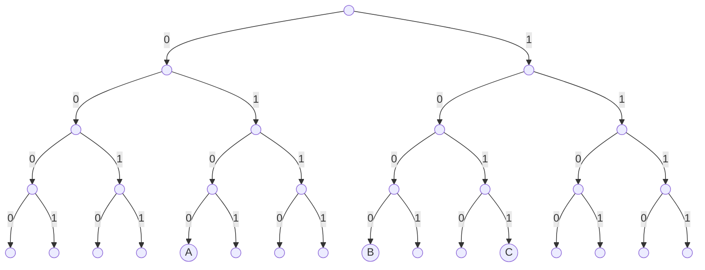
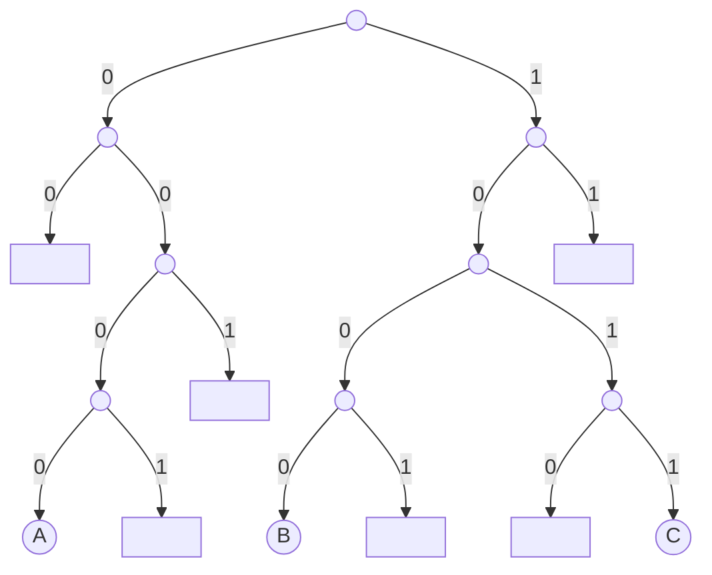
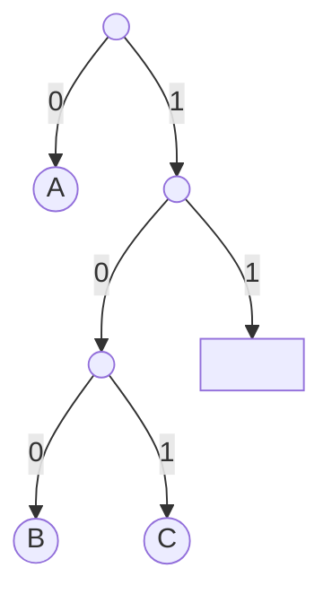
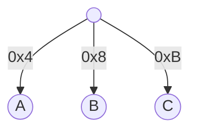

# Introduction

`Jellyfish Merkle Tree`(JMT) is the sparse merkle tree solution adopted by `zksync-era`. 

It features a `tractable radix representation` for sparse merkle tree and `version-based key` that reduces compaction for LSM-tree based key-value storage.


# Tractable Radix Representation

While a full tree with h-bit keys of size $2^h$ is an intractable representation when h is a large value, JMT transforms it into a tractable one for a sparse merkle tree.

Let's go through the process by an example.

A naive merkle tree may look like this:



JMT first incorporates two optimizations:
1. Subtrees that consist entirely of empty nodes are replaced with a placeholder value, indicated with □.
2. Subtrees consisting of exactly one leaf are replaced with a single node.

After optimization 1 it looks like this:



After optimization 2 it looks like this:



(Note that the full key of leaf nodes are also stored together with the node since it's no longer inferable from the path.)

As an update of a single leaf node can require all the nodes on the path to the root to be updated together, JMT further employs a radix merkle tree structure to reduce the I/O. A radix merkle tree with radix `r` is the compressed version of the corresponding merkle tree such that every $log_2 (r)$ levels of the original merkle tree are compressed into a single level where each node has maximum `r` children, though some children may not exist.

Most radix merkle trees choose `r=16`, so instead of bit by by, traversing downward consumes one nibble(4 bits) at a time.

Paired with the above optimizations, the original merkle tree finally looks like this:



# Version-based Key

Since nodes are stored in a key-value store, each node is associated with a unique key. JMT adopts a version-based node key
schema, by splicing `version` and `nibble path`, as:

```
version ‖ nibble path
```

where the node of this key is created at `version` and `nibble path` is the sequence of nibbles on the path from the root node to this node following the given key.

There are two advantages of the version-based node key over widely adopted hash-based node key:
1. Compared to a fixed-length hash-based node key, a JMT node key takes less space in a sparse merkle tree. For a JMT of 256-bit keys and 1 billion leaves, the average height is around 8 nibbles. The average size of all the node keys is about 12 bytes, significantly smaller than 32 bytes of a 256-bit hash key.
2.  The versioned JMT could remarkably reduce compactions to zero, thereby achieving the optimal write amplification as one. In LevelDB or RocksDB, all the data is stored as key-value pairs and all keys are sorted by a predefined order, usually lexicographic or reverse-lexicographic order. If a hash key is adopted, each insertion will insert a new key-value pair at a random position within the current key spectrum. But given the JMT node key schema, we could insert the new nodes generated by each version sequentially to append to the current key set in storage according to the lexicographic order because our key schema ensures keys of a high version are always lexicographically greater than that at a lower version. In this case, compaction is no longer necessary as the keys inserted are already ordered. Experiment shows this schema saves IOPS and disk bandwidth by more than 90% in contrast to hash-based node keys.

# Implementation

(in progress)

# References
1. https://developers.diem.com/papers/jellyfish-merkle-tree/2021-01-14.pdf