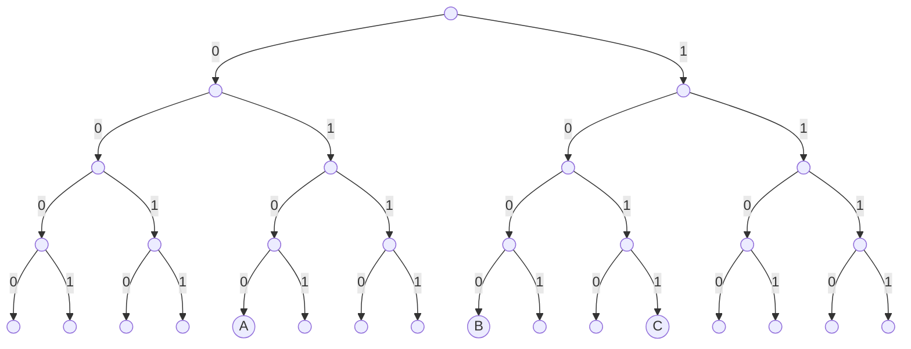
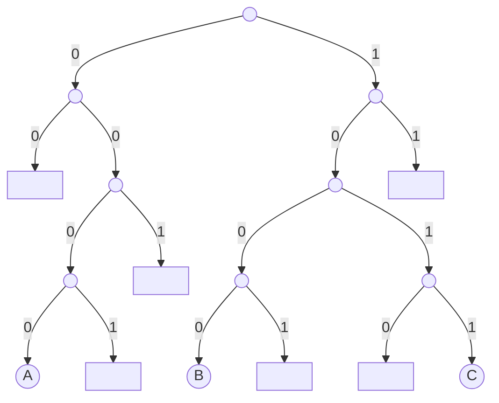
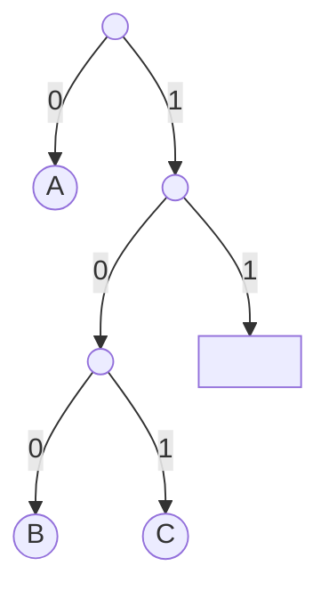
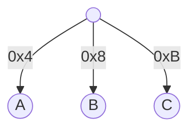

# Introduction

`Jellyfish Merkle Tree`(JMT) is the sparse merkle tree solution adopted by `zksync-era`. 

It features a `tractable radix representation` for sparse merkle tree and `version-based key` that reduces compaction for LSM-tree based key-value storage.


# Tractable Radix Representation

While a full tree with h-bit keys of size $2^h$ is an intractable representation when h is a large value, JMT transforms it into a tractable one for a sparse merkle tree.

Let's go through the process by an example.

A naive merkle tree may look like this:



JMT first incorporates two optimizations:
1. Subtrees that consist entirely of empty nodes are replaced with a placeholder value, indicated with □.
2. Subtrees consisting of exactly one leaf are replaced with a single node.

After optimization 1 it looks like this:



After optimization 2 it looks like this:



(Note that the full key of leaf nodes are also stored together with the node since it's no longer inferable from the path.)

As an update of a single leaf node can require all the nodes on the path to the root to be updated together, JMT further employs a radix merkle tree structure to reduce the I/O. A radix merkle tree with radix `r` is the compressed version of the corresponding merkle tree such that every $log_2 (r)$ levels of the original merkle tree are compressed into a single level where each node has maximum `r` children, though some children may not exist.

Most radix merkle trees choose `r=16`, so instead of bit by by, traversing downward consumes one nibble(4 bits) at a time.

Paired with the above optimizations, the original merkle tree finally looks like this:



# Version-based Key

Since nodes are stored in a key-value store, each node is associated with a unique key. JMT adopts a version-based node key
schema, by splicing `version` and `nibble path`, as:

```
version ‖ nibble path
```

where the node of this key is created at `version` and `nibble path` is the sequence of nibbles on the path from the root node to this node following the given key.

There are two advantages of the version-based node key over widely adopted hash-based node key:
1. Compared to a fixed-length hash-based node key, a JMT node key takes less space in a sparse merkle tree. For a JMT of 256-bit keys and 1 billion leaves, the average height is around 8 nibbles. The average size of all the node keys is about 12 bytes, significantly smaller than 32 bytes of a 256-bit hash key.
2. The automatic compaction inside LSM-tree based key-value storage is effectively disabled because of the version based keys, users can choose when to prune the stale keys as convenient.

# Implementation

## [`extend`](https://github.com/matter-labs/zksync-era/blob/b00c461f1493759effc31ab77552797d3cc0d669/core/lib/merkle_tree/src/lib.rs#L210)

This method is used for extending the tree by creating a new batch.

More specifically:
1. [Fetch](https://github.com/matter-labs/zksync-era/blob/b00c461f1493759effc31ab77552797d3cc0d669/core/lib/merkle_tree/src/lib.rs#L211) the version number for the current batch(always increment by 1 from the previous version).
2. [Create](https://github.com/matter-labs/zksync-era/blob/b00c461f1493759effc31ab77552797d3cc0d669/core/lib/merkle_tree/src/lib.rs#L212) an `Storage` instance for accumulating mutations of the current batch.
    1. It will keep track of all essential info for the current batch, including leaf nodes, internal nodes, next version number etc, in memory.
3. [Extend](https://github.com/matter-labs/zksync-era/blob/b00c461f1493759effc31ab77552797d3cc0d669/core/lib/merkle_tree/src/lib.rs#L213) the merkle tree with leafs, generating/mutating internal nodes as necessary.
    1. [Load](https://github.com/matter-labs/zksync-era/blob/b00c461f1493759effc31ab77552797d3cc0d669/core/lib/merkle_tree/src/storage/mod.rs#L295) the closest ancestor nibble paths of all leaf keys of the current batch.
        1. All nodes along the closest ancestor nibble paths are also [loaded](https://github.com/matter-labs/zksync-era/blob/b00c461f1493759effc31ab77552797d3cc0d669/core/lib/merkle_tree/src/storage/patch.rs#L558) into memory, level by level.
    2. [Insert](https://github.com/matter-labs/zksync-era/blob/b00c461f1493759effc31ab77552797d3cc0d669/core/lib/merkle_tree/src/storage/mod.rs#L302) the leafs of the current batch into the merkle tree, aided with the info about the closest ancestor nibble path.
        1. [Traverse](https://github.com/matter-labs/zksync-era/blob/b00c461f1493759effc31ab77552797d3cc0d669/core/lib/merkle_tree/src/storage/mod.rs#L141) nodes down from the closest ancestor nibble path, until a position where either a leaf node is reached or a missing child of internal node is found.
        2. [Adjust](https://github.com/matter-labs/zksync-era/blob/b00c461f1493759effc31ab77552797d3cc0d669/core/lib/merkle_tree/src/storage/mod.rs#L142-L213) nodes according to the traverse result.
            1. If a leaf node with the same key is reached, just [update](https://github.com/matter-labs/zksync-era/blob/b00c461f1493759effc31ab77552797d3cc0d669/core/lib/merkle_tree/src/storage/mod.rs#L145) the `value_hash` field of [`LeafNode`](https://github.com/matter-labs/zksync-era/blob/b00c461f1493759effc31ab77552797d3cc0d669/core/lib/merkle_tree/src/types/internal.rs#L334).
            2. If a leaf node with mismatching key is reached:
                1. If the leaf node does have a parent internal node, [update](https://github.com/matter-labs/zksync-era/blob/b00c461f1493759effc31ab77552797d3cc0d669/core/lib/merkle_tree/src/storage/mod.rs#L152) corresponding `is_leaf` field of [`ChildRef`](https://github.com/matter-labs/zksync-era/blob/b00c461f1493759effc31ab77552797d3cc0d669/core/lib/merkle_tree/src/types/internal.rs#L353) to `false`.
                2. [Insert](https://github.com/matter-labs/zksync-era/blob/b00c461f1493759effc31ab77552797d3cc0d669/core/lib/merkle_tree/src/storage/mod.rs#L155-L174) internal nodes down the nibble path until `moved_leaf_nibble` and `new_leaf_nibble` don't match.
                3. [Insert](https://github.com/matter-labs/zksync-era/blob/b00c461f1493759effc31ab77552797d3cc0d669/core/lib/merkle_tree/src/storage/mod.rs#L176-L182) the moved leaf and new leaf at the shortest nibble path they differ.
            3. If a missing child of internal node is found:
                1. If the tree is empty, just [insert](https://github.com/matter-labs/zksync-era/blob/b00c461f1493759effc31ab77552797d3cc0d669/core/lib/merkle_tree/src/storage/mod.rs#L185-L193) the new leaf node at the root.
                2. Otherwise, [insert](https://github.com/matter-labs/zksync-era/blob/b00c461f1493759effc31ab77552797d3cc0d669/core/lib/merkle_tree/src/storage/mod.rs#L195-L205) a `ChildRef` at the found position of the internal node and the new leaf at the next nibble path.
        3. [Traverse](https://github.com/matter-labs/zksync-era/blob/b00c461f1493759effc31ab77552797d3cc0d669/core/lib/merkle_tree/src/storage/mod.rs#L215) nodes up to the root level and update `ChildRef.version`.
    3. [Compute](https://github.com/matter-labs/zksync-era/blob/b00c461f1493759effc31ab77552797d3cc0d669/core/lib/merkle_tree/src/storage/mod.rs#L311) node hashes and the changeset, from bottom levels to top levels.
4. [Persist](https://github.com/matter-labs/zksync-era/blob/b00c461f1493759effc31ab77552797d3cc0d669/core/lib/merkle_tree/src/lib.rs#L214) the mutations of the current batch into database.
    1. [Persist](https://github.com/matter-labs/zksync-era/blob/b00c461f1493759effc31ab77552797d3cc0d669/core/lib/merkle_tree/src/storage/rocksdb.rs#L199) the new manifest.
    2. [Persist](https://github.com/matter-labs/zksync-era/blob/b00c461f1493759effc31ab77552797d3cc0d669/core/lib/merkle_tree/src/storage/rocksdb.rs#L201-L224) the roots and nodes.
    3. [Clear](https://github.com/matter-labs/zksync-era/blob/b00c461f1493759effc31ab77552797d3cc0d669/core/lib/merkle_tree/src/storage/rocksdb.rs#L226-L236) the stale keys.

## [`extend_with_proofs`](https://github.com/matter-labs/zksync-era/blob/b00c461f1493759effc31ab77552797d3cc0d669/core/lib/merkle_tree/src/lib.rs#L225)

This method is used for both extending the tree and generating a proof for each [`TreeInstruction`](https://github.com/matter-labs/zksync-era/blob/b00c461f1493759effc31ab77552797d3cc0d669/core/lib/merkle_tree/src/types/mod.rs#L12) at the same time.

More specifically:
1. [Load](https://github.com/matter-labs/zksync-era/blob/b00c461f1493759effc31ab77552797d3cc0d669/core/lib/merkle_tree/src/storage/proofs.rs#L266) the closest ancestor nibble paths of all leaf keys of the current batch.
2. [Compute](https://github.com/matter-labs/zksync-era/blob/b00c461f1493759effc31ab77552797d3cc0d669/core/lib/merkle_tree/src/storage/proofs.rs#L269) leaf indices for each write instruction(leaf index for read instruction is always 0).
3. [Split](https://github.com/matter-labs/zksync-era/blob/b00c461f1493759effc31ab77552797d3cc0d669/core/lib/merkle_tree/src/storage/proofs.rs#L270) the instructions into 16 groups according to the 1st nibble of the key.
4. [Split](https://github.com/matter-labs/zksync-era/blob/b00c461f1493759effc31ab77552797d3cc0d669/core/lib/merkle_tree/src/storage/proofs.rs#L274) the loaded nodes into 16 groups also according to the 1st nibble.
5. [Extend](https://github.com/matter-labs/zksync-era/blob/b00c461f1493759effc31ab77552797d3cc0d669/core/lib/merkle_tree/src/storage/proofs.rs#L280-L292) 16 subtrees in parallel, also generating a subtree proof for each instruction.
    1. For read instruction, the subtree proof is created by [specifying](https://github.com/matter-labs/zksync-era/blob/b00c461f1493759effc31ab77552797d3cc0d669/core/lib/merkle_tree/src/storage/proofs.rs#L184) `root_nibble_count` as 1.
    2. For write instruction, the subtree proof is created by [`break`](https://github.com/matter-labs/zksync-era/blob/b00c461f1493759effc31ab77552797d3cc0d669/core/lib/merkle_tree/src/storage/proofs.rs#L157-L159) when the root is traversed.
6. [Merge](https://github.com/matter-labs/zksync-era/blob/b00c461f1493759effc31ab77552797d3cc0d669/core/lib/merkle_tree/src/storage/proofs.rs#L296-L299) the loaded nodes from 16 subtrees, excluding the root node, which is dealt with separately in [`finalize_logs`](https://github.com/matter-labs/zksync-era/blob/b00c461f1493759effc31ab77552797d3cc0d669/core/lib/merkle_tree/src/storage/proofs.rs#L212).
7. [Merge](https://github.com/matter-labs/zksync-era/blob/b00c461f1493759effc31ab77552797d3cc0d669/core/lib/merkle_tree/src/storage/proofs.rs#L303) back the logs according to the original order of the corresponding instruction.
8. [Extend](https://github.com/matter-labs/zksync-era/blob/b00c461f1493759effc31ab77552797d3cc0d669/core/lib/merkle_tree/src/storage/proofs.rs#L356) the subtree proofs to the root by [appending](https://github.com/matter-labs/zksync-era/blob/b00c461f1493759effc31ab77552797d3cc0d669/core/lib/merkle_tree/src/hasher/nodes.rs#L232) merkle path corresponding to the 1st nibble and [compute](https://github.com/matter-labs/zksync-era/blob/b00c461f1493759effc31ab77552797d3cc0d669/core/lib/merkle_tree/src/storage/proofs.rs#L359-L362) the changeset.
9. [Persist](https://github.com/matter-labs/zksync-era/blob/b00c461f1493759effc31ab77552797d3cc0d669/core/lib/merkle_tree/src/lib.rs#L232) the mutations of the current batch into database.

## [`entries`](https://github.com/matter-labs/zksync-era/blob/b00c461f1493759effc31ab77552797d3cc0d669/core/lib/merkle_tree/src/getters.rs#L20)

This method is used for reading tree entries, which is trivial after fetching the closest ancestor nibble path.

## [`entries_with_proofs`](https://github.com/matter-labs/zksync-era/blob/b00c461f1493759effc31ab77552797d3cc0d669/core/lib/merkle_tree/src/getters.rs#L70)

This method is used for both reading tree entries and corresponding proofs at the same time.

# References
1. https://developers.diem.com/papers/jellyfish-merkle-tree/2021-01-14.pdf