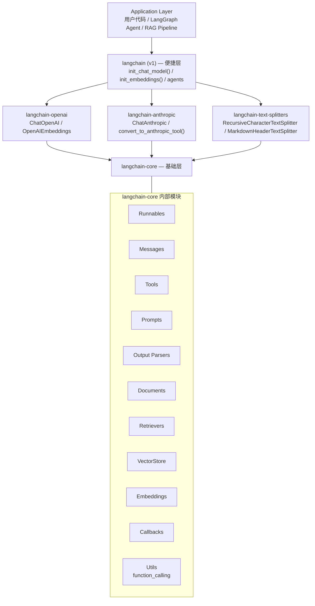
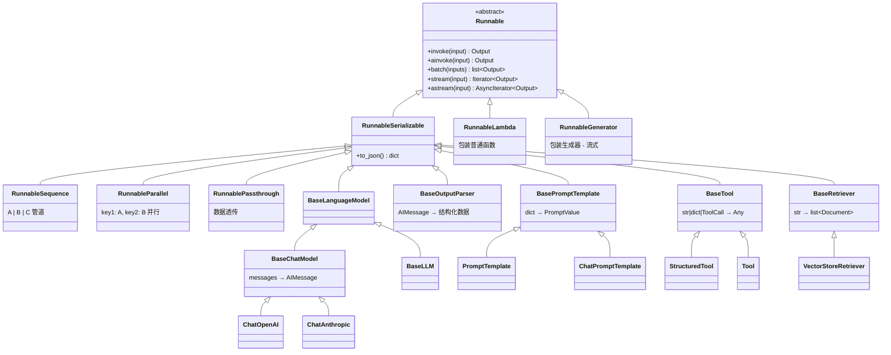
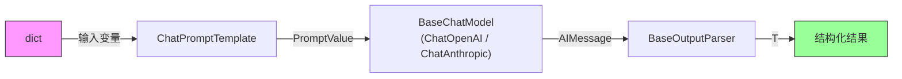
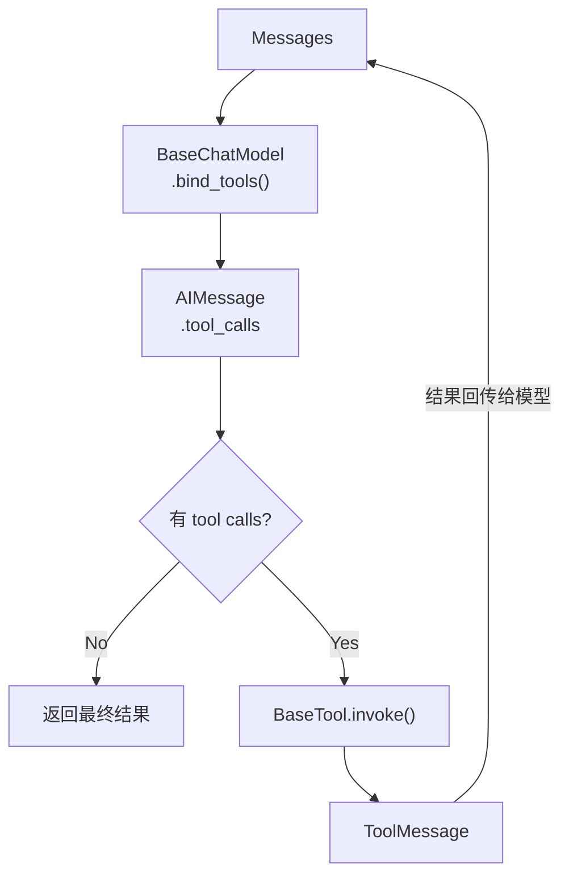
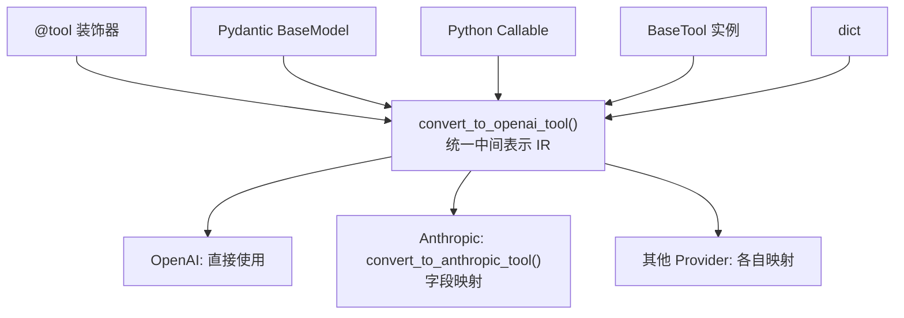
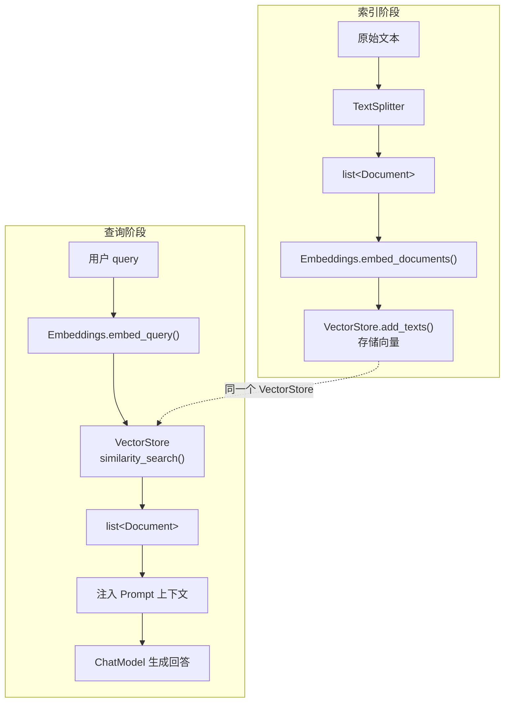
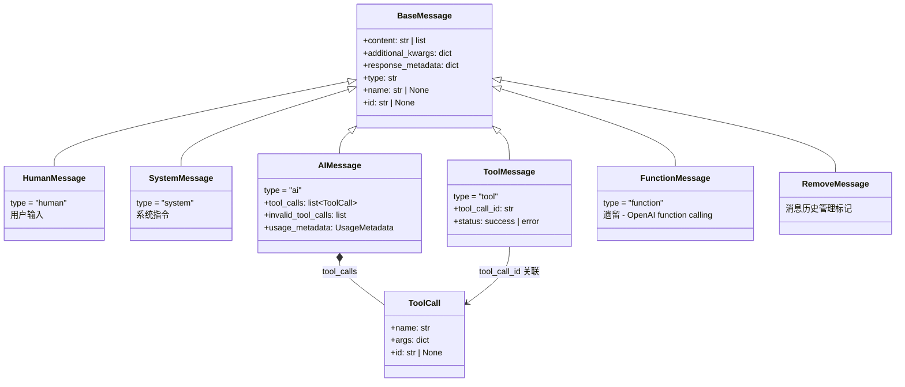
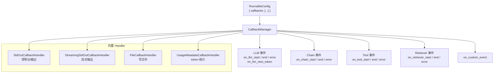
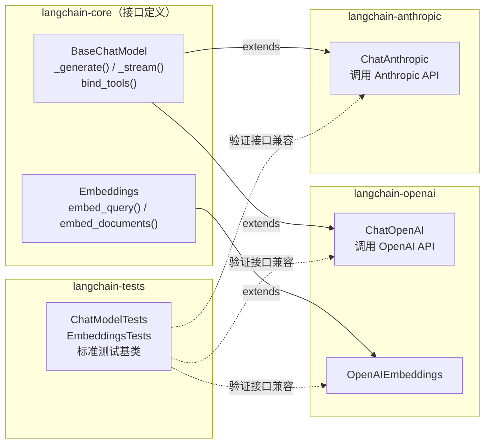
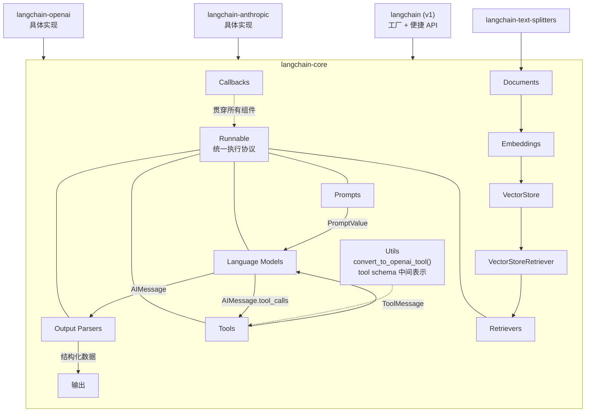

# LangChain 项目架构与核心模块交互

## 一、分层架构总览

---

## 二、Runnable — 一切的基石

`Runnable` 是整个 LangChain 的核心抽象。几乎所有组件都继承自它，使得任何组件都能通过 `|` 管道符组合。

**统一接口**：所有 Runnable 都实现这些方法：

| 方法 | 说明 |
|------|------|
| `invoke(input)` | 单次同步调用 |
| `ainvoke(input)` | 单次异步调用 |
| `batch(inputs)` | 批量调用 |
| `stream(input)` | 流式输出 |
| `astream(input)` | 异步流式 |

---

## 三、核心数据流

### 1. 基本对话链

> **LCEL 写法**: `chain = prompt | model | parser`

### 2. Tool Calling 循环

### 3. Tool Schema 转换流程

### 4. RAG 检索链

---

## 四、消息体系

---

## 五、回调系统 — 贯穿全局的观测层

每个 Runnable 的 `invoke/stream/batch` 调用时，都会将 `callbacks` 通过 `RunnableConfig` 传播给下游，形成完整的调用链追踪。

---

## 六、Partner 集成模式

---

## 七、模块依赖关系总图

---

## 核心设计思想

1. **Runnable 统一协议** — 一切皆 Runnable，通过 `|` 组合，自动获得 sync/async/stream/batch 能力
2. **分层解耦** — core 定义接口，partner 实现细节，langchain 提供便捷入口
3. **消息驱动** — 组件间通过类型化的 Message 对象通信，tool call 也内嵌在 AIMessage 中
4. **回调观测** — Callbacks 通过 RunnableConfig 自动传播，实现全链路可观测