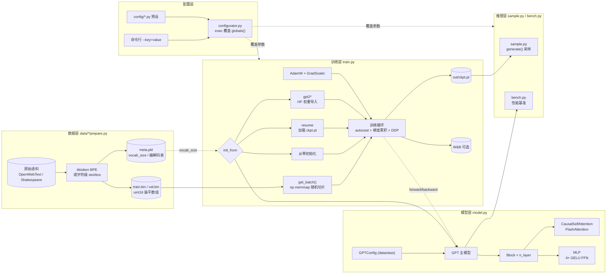
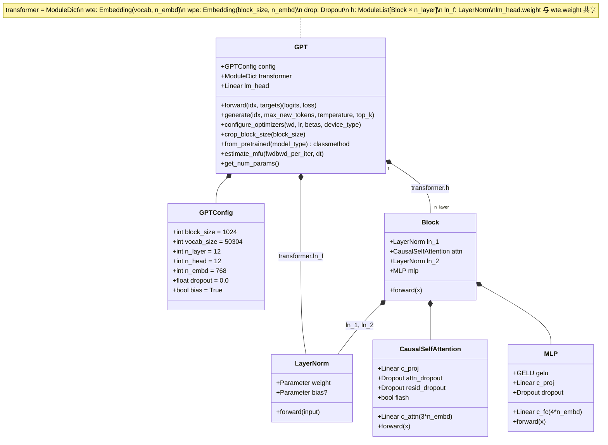
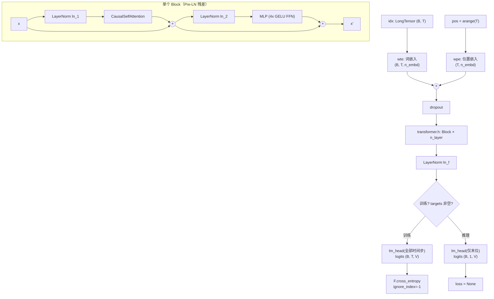
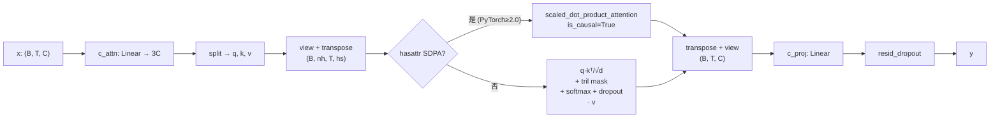
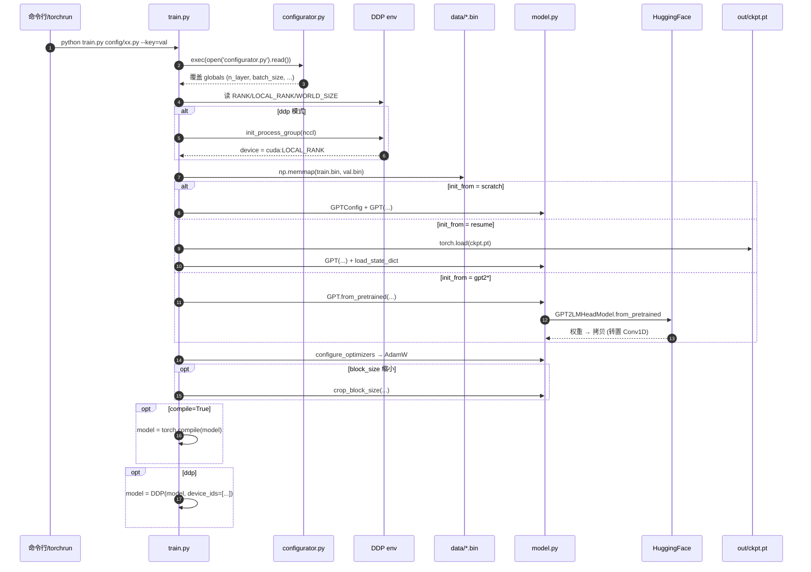
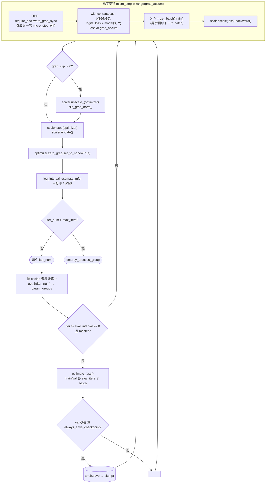
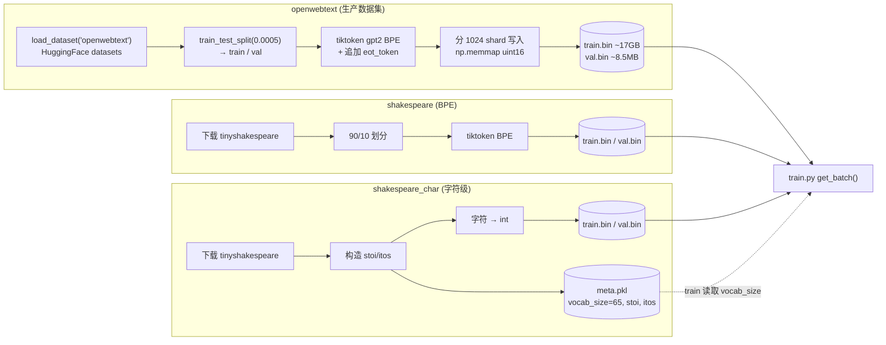
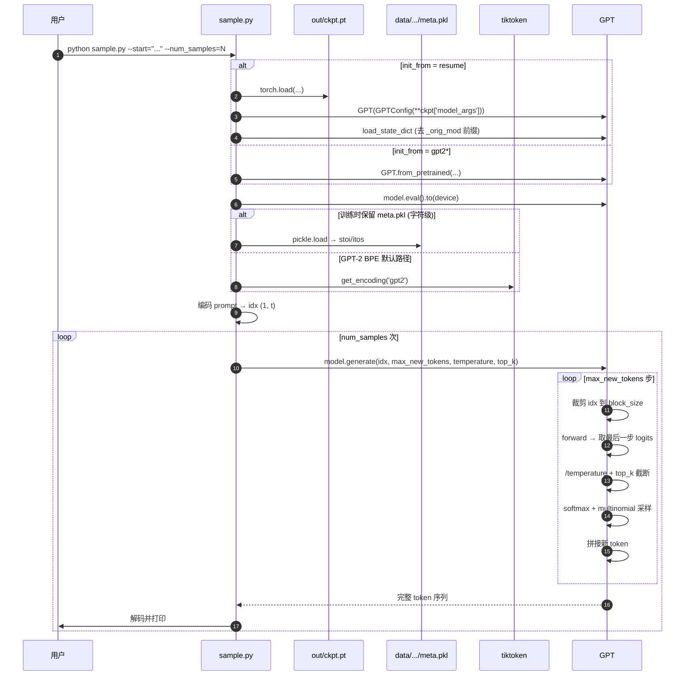
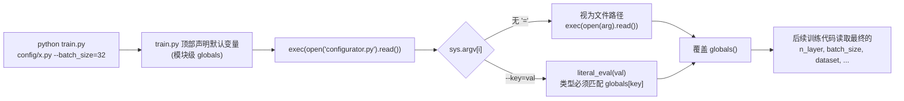

# nanoGPT 架构与核心模块交互总结

> 仓库：`karpathy/nanoGPT` — 一个用于复现 / 微调 GPT-2 的极简 PyTorch 实现。整个工程只有 **一个模型文件 `model.py` (~300 行)** 和 **一个训练脚本 `train.py` (~330 行)**，强调"读得完、改得动、能跑通"。

---

## 1. 项目原理

nanoGPT 是 **decoder-only Transformer 语言模型** 的最小可用复现，遵循 GPT-2 的设计：

| 维度 | 设计 |
|------|------|
| 任务目标 | 自回归语言建模：给定前 $t$ 个 token，预测第 $t{+}1$ 个 token 的分布。损失为 token 级 cross-entropy。 |
| 结构范式 | Decoder-only Transformer，Pre-LayerNorm（先 LN 再 Attn/MLP），残差相加。 |
| 注意力 | Causal multi-head self-attention；PyTorch ≥ 2.0 时调用 `scaled_dot_product_attention`（FlashAttention 路径），否则手写 softmax + 下三角 mask。 |
| 位置信息 | 学习式绝对位置嵌入 `wpe`（不是 RoPE / ALiBi）。 |
| 权重绑定 | `lm_head.weight` 与 token embedding `wte.weight` 共享（weight tying）。 |
| 优化器 | AdamW，二维参数（权重矩阵 + embedding）做 weight decay，bias / LayerNorm 不做；CUDA 上启用 fused 实现。 |
| 学习率调度 | 线性 warmup → cosine decay 到 `min_lr`。 |
| 训练精度 | `torch.amp.autocast`（bfloat16 优先，float16 配 `GradScaler`），并启用 TF32。 |
| 加速 | `torch.compile`（PyTorch 2.0 图编译）+ FlashAttention + 可选 DDP 多卡 / 多机训练。 |
| 数据 | 预处理阶段把语料 BPE 化（`tiktoken`）或字符化，序列化为 `uint16` 的扁平 `train.bin` / `val.bin`，训练时用 `np.memmap` 随机切片，零拷贝喂入 GPU。 |
| 训练 vs 推理 | 训练时计算全序列 logits 与 loss；推理时仅对最后一个时间步做 `lm_head`，再做 `top-k` + `temperature` 采样自回归生成。 |

设计哲学：**配置即代码**（`configurator.py` 用 `exec` 把 CLI / 配置文件直接覆盖到 `globals()`），**模型即一个 `nn.Module`**（没有 Trainer 抽象，没有 lightning，没有 hydra）。

---

## 2. 仓库文件结构

```
nanoGPT/
├── model.py                # GPT / Block / Attention / MLP / LayerNorm，单文件模型
├── train.py                # 训练入口：数据加载 + 优化器 + DDP + AMP + 调度 + 检查点
├── sample.py               # 加载 checkpoint 或 HF GPT-2，自回归采样
├── bench.py                # 不保存 checkpoint 的最小训练循环，用于性能基准
├── configurator.py         # CLI / py 文件覆盖 globals() 的"穷人版"配置系统
├── config/                 # 各任务预设：train_gpt2, train_shakespeare_char, finetune_shakespeare, eval_gpt2*
└── data/
    ├── openwebtext/prepare.py        # HF datasets + tiktoken BPE → train.bin / val.bin
    ├── shakespeare/prepare.py        # 小语料 BPE 化
    └── shakespeare_char/prepare.py   # 字符级编码 + meta.pkl(stoi/itos)
```

---

## 3. 顶层架构图



---

## 4. 模型结构（`model.py`）

### 4.1 类层级与组合关系



关键设计点：

- **权重绑定**：`self.transformer.wte.weight = self.lm_head.weight`（`model.py:138`）。
- **残差缩放初始化**：所有以 `c_proj.weight` 结尾的层用 `std = 0.02/sqrt(2*n_layer)` 初始化（GPT-2 论文 Trick，`model.py:143-145`）。
- **优化器参数分组**：维度 ≥ 2 的张量做 weight decay，其余不做（`configure_optimizers`，`model.py:263-287`）。
- **`from_pretrained`**：从 HuggingFace `GPT2LMHeadModel` 拷贝权重，对 `Conv1D` 风格的四个权重做转置（`model.py:245`）。

### 4.2 单步前向数据流



### 4.3 `CausalSelfAttention` 内部



---

## 5. 训练循环（`train.py`）

### 5.1 启动 / 初始化序列



### 5.2 单步训练循环



要点：

- **梯度累积 + DDP**：通过手动开关 `model.require_backward_grad_sync` 跳过中间 micro-step 的 all-reduce，只在最后一步同步（`train.py:292-305`），避免 `no_sync()` 上下文。
- **异步取批**：当前 step 在 GPU 上做前向时，CPU 端立刻预取下一个 batch（pin_memory + `non_blocking=True`，`train.py:127-131,303`）。
- **GradScaler**：仅当 `dtype == 'float16'` 时真正生效，`bfloat16` 下是 no-op。
- **MFU 估计**：依据 PaLM 论文 Appendix B 的公式 `flops_per_token = 6N + 12LHQT`，归一化到 A100 bf16 峰值 312 TFLOPS（`model.py:289-303`）。

---

## 6. 数据准备流（`data/*/prepare.py`）



`get_batch(split)` 的核心是：

```
data = np.memmap(...)
ix   = randint(len(data) - block_size, (batch_size,))
x    = stack(data[i : i+block_size])      # 输入
y    = stack(data[i+1 : i+1+block_size])  # 右移一位的标签
```

即每个 batch 都从全量 token 流中随机抽 `batch_size` 个 `block_size` 长的窗口，标签是输入右移一位，天然实现 teacher forcing。

---

## 7. 推理 / 采样（`sample.py`）



`bench.py` 与 `train.py` 几乎同构，但 (1) 不写检查点 / 不做 eval；(2) 可选 `torch.profiler` 导出 TensorBoard trace；(3) 用前 10 步预热、后 20 步计时，输出 `time/iter` 与 MFU。

---

## 8. 配置覆盖机制（`configurator.py`）



这是 nanoGPT 最有争议但也最简洁的设计：所有配置项就是脚本顶部的普通 Python 变量，`configurator.py` 通过 `exec` 直接改写宿主脚本的 `globals()`，因此无需任何 `config.xxx` 前缀。

---

## 9. 三类典型运行路径

| 场景 | 启动 | 关键路径 |
|------|------|----------|
| 从零训练 GPT-2 124M | `torchrun --standalone --nproc_per_node=8 train.py config/train_gpt2.py` | `init_from='scratch'` → 新建 GPT → AdamW → 600k iter / 300B tokens |
| 字符级 Shakespeare 玩具 | `python train.py config/train_shakespeare_char.py` | `meta.pkl` 提供 `vocab_size=65` → 6 层小模型 → 5000 iter |
| 微调 GPT-2-XL | `python train.py config/finetune_shakespeare.py` | `init_from='gpt2-xl'` → HF 权重导入 → 常数 LR 微调 20 iter |
| 采样 | `python sample.py --out_dir=out-shakespeare-char --start="ROMEO:"` | 加载 ckpt → `generate()` 自回归 |
| 评估预训练 GPT-2 | `python train.py config/eval_gpt2.py` | `eval_only=True` → 仅跑一次 `estimate_loss` |
| 性能基准 | `python bench.py` | 不存盘 / 不做 DDP / 可选 profiler |

---

## 10. 关键交互一句话总结

> **`configurator.py`** 把命令行和 `config/*.py` 注入 **`train.py`** 的 `globals`；**`train.py`** 用 **`data/*/prepare.py`** 写出的 **`train.bin`** 通过 **`np.memmap`** 喂数据，把 **`model.py`** 的 **`GPT`**（由 **`Block`**、**`CausalSelfAttention`**、**`MLP`** 组成）放进 **AMP + DDP + torch.compile** 的训练环里，定期写出 **`out/ckpt.pt`**；**`sample.py`** 读回该 checkpoint 调 **`GPT.generate`** 完成自回归采样；**`bench.py`** 则跑同样的 forward/backward 用于性能基准。
