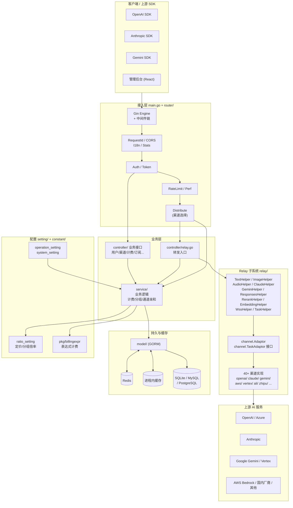
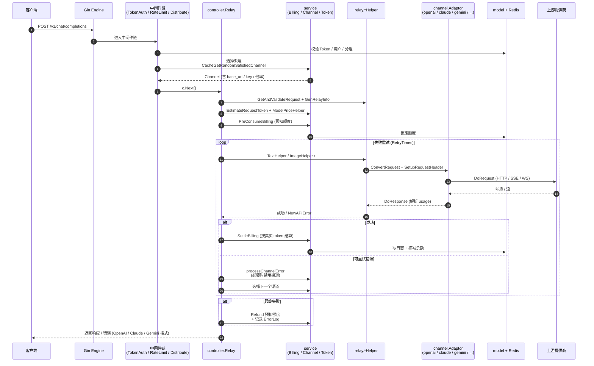
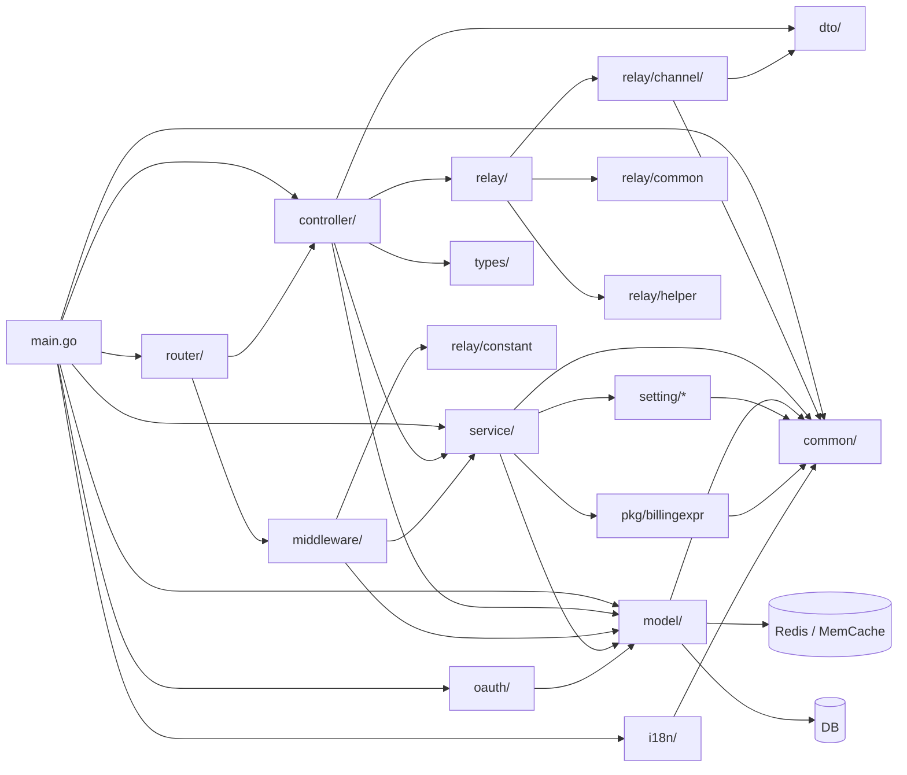
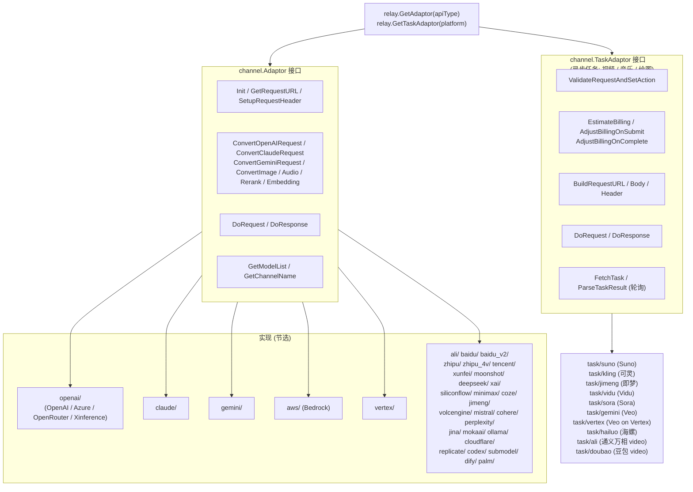
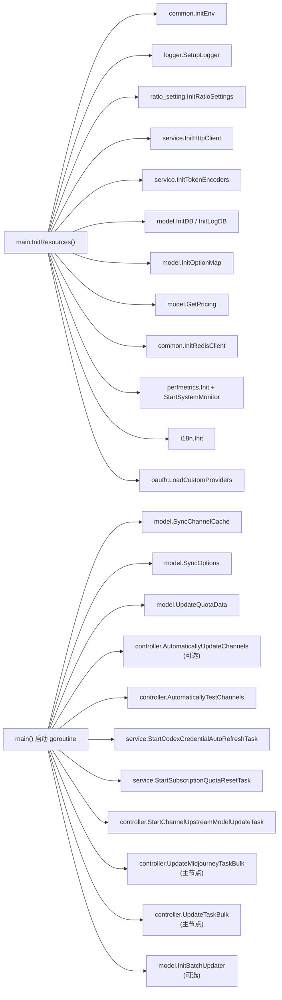
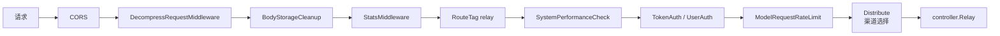

# new-api 架构概览

> 项目: **new-api** ([QuantumNous](https://github.com/QuantumNous))
> 一个面向 40+ 上游 AI 提供商（OpenAI / Claude / Gemini / Azure / AWS Bedrock 等）的统一 API 网关 / 代理，内置用户体系、计费、限流和管理后台。

---

## 1. 技术栈与分层

- **后端**: Go 1.22+、Gin、GORM v2
- **前端**: React 19（默认主题 `web/default`，Rsbuild + Base UI + Tailwind），React 18 经典主题（`web/classic`，Vite + Semi Design）
- **存储**: SQLite / MySQL / PostgreSQL（三者全部兼容）+ Redis + 进程内缓存
- **认证**: JWT、WebAuthn/Passkey、OAuth（GitHub、Discord、OIDC、Telegram、LinuxDo、WeChat、Custom...）

整体遵循 **Router → Controller → Service → Model** 的分层方式，Relay 作为独立的"代理子系统"横向贯穿。

---

## 2. 目录职责速查

| 目录 | 职责 |
| --- | --- |
| `main.go` | 启动入口：加载 env、初始化 DB / Redis / i18n / Token 编码器 / 定价数据，注册路由并拉起 Gin |
| `router/` | 路由编排：`api-router`、`dashboard`、`relay-router`、`video-router`、`web-router` |
| `middleware/` | 鉴权、限流、CORS、I18n、RequestId、Distributor（核心：渠道选择）、Stats、Recovery |
| `controller/` | 控制器：用户、渠道、令牌、订阅、支付、OAuth、Relay 入口、Midjourney、Task |
| `service/` | 业务逻辑：通道选择、亲和度、计费（pre-consume / settle / refund / violation）、Token 估算、订阅、敏感词 |
| `relay/` | Relay 子系统：协议 Helper + Adapter 注册表（`relay_adaptor.go`） |
| `relay/channel/<provider>/` | 单个上游适配器，实现 `channel.Adaptor`（或 `TaskAdaptor`） |
| `relay/common/` | RelayInfo、价格上下文、Billing Session |
| `model/` | GORM 模型与 DB 访问（Channel、User、Token、Log、Task、Pricing、Cache） |
| `setting/` | 运行时配置：`ratio_setting`、`model_setting`、`operation_setting`、`system_setting`、`billing_setting`、`reasoning` 等 |
| `dto/` | 上下行数据传输结构（请求/响应） |
| `pkg/billingexpr/` | 表达式计费引擎（见 `expr.md`） |
| `oauth/` | 各 OAuth Provider 适配 |
| `i18n/` | 后端 i18n（en/zh），前端 i18n 在 `web/default/src/i18n/` |
| `common/` | JSON 包装（统一入口）、Redis、Env、限流、加密、Cache 等工具 |

---

## 3. Relay 请求生命周期

下图展示一次 `/v1/chat/completions` 请求从客户端到上游再返回的完整路径，覆盖鉴权、渠道选择、预扣费、转发、重试、结算等关键环节。

要点：

- **入口统一**: `controller.Relay(c, relayFormat)` 按 `RelayFormat` 分派到对应 Helper（OpenAI / Claude / Gemini / Responses / Image / Audio / Embedding / Rerank / Realtime WSS）。
- **渠道选择**: `middleware.Distribute` 先按 Token 限制、分组、通道亲和度选择渠道；失败时 `controller.Relay` 在重试循环中再次调用 `service.CacheGetRandomSatisfiedChannel`。
- **适配器接口**: `relay/channel/adapter.go` 中的 `Adaptor` / `TaskAdaptor` 是所有上游的统一抽象；`relay.GetAdaptor(apiType)` / `relay.GetTaskAdaptor(platform)` 注册表完成多态分发。
- **计费三段式**: 预扣（`PreConsumeBilling`）→ 实际转发 → 结算（`SettleBilling`），失败时 `Billing.Refund`；违规额外扣费由 `ChargeViolationFeeIfNeeded` 处理。

---

## 4. 模块依赖关系

> 注意：`service → relay` 的循环依赖通过 `service.GetTaskAdaptorFunc` 在 `main.go` 中注入（见 `main.go` 中的注释 `// Wire task polling adaptor factory (breaks service -> relay import cycle)`）。

---

## 5. 渠道适配器插件结构

`relay/relay_adaptor.go` 是适配器的总注册表；每个 `relay/channel/<provider>` 目录是一个独立插件。

新增一个上游通常只需要：

1. 新建 `relay/channel/<name>/`，实现 `Adaptor`（或 `TaskAdaptor`）；
2. 在 `relay_adaptor.go` 的 switch 中注册；
3. 在 `constant/` 中追加 `APIType` / `ChannelType`；
4. 若支持 `StreamOptions` 则加入 `streamSupportedChannels`（见 CLAUDE.md Rule 4）。

---

## 6. 启动期与后台任务

`main.go::InitResources` 完成所有初始化；启动后会拉起若干常驻 goroutine，承担缓存同步、渠道健康检查、订阅重置、任务轮询等。

---

## 7. 中间件链 (Relay)

`router/relay-router.go` 中典型的中间件叠加顺序：

- `TokenAuth` 解析 `Authorization: Bearer sk-xxx` 校验令牌、绑定用户/分组/限额。
- `Distribute` 是核心：解析请求体里的 `model`，按分组 / 通道亲和 / Token 模型白名单选出一个 `Channel` 并写入 ctx。
- `ModelRequestRateLimit` 基于模型的请求级限流。
- 失败重试在 `controller.Relay` 内部完成（不是中间件），可在多个渠道间切换。

---

## 8. 计费体系简述

- **价格来源**: `model/pricing*.go` + `setting/ratio_setting`（按渠道/分组/模型倍率叠加）。
- **表达式定价**: `pkg/billingexpr/`（详见 `pkg/billingexpr/expr.md`），支持按 token / 时长 / 分辨率等动态计费。
- **流程**:
  1. `helper.ModelPriceHelper` 估算 `QuotaToPreConsume`；
  2. `service.PreConsumeBilling` 预扣（持有 `Billing` 句柄）；
  3. 转发成功后 `service.SettleBilling`（按上游真实 usage 结算差额）；
  4. 失败时 `Billing.Refund`；命中规则时 `service.ChargeViolationFeeIfNeeded` 额外扣费。
- **跨数据库兼容**: 所有原始 SQL 使用 `commonGroupCol` / `commonKeyCol` / `commonTrueVal` 等抽象（CLAUDE.md Rule 2）。

---

## 9. 关键约束（来自 CLAUDE.md）

- JSON 必须走 `common/json.go` 包装函数，禁止直接使用 `encoding/json` 的 Marshal/Unmarshal。
- DB 代码必须同时兼容 SQLite / MySQL ≥ 5.7.8 / PostgreSQL ≥ 9.6，优先 GORM 抽象。
- 前端使用 **Bun** 作为包管理器与脚本运行器（`web/default`）。
- 上游 Relay 请求 DTO 的可选标量字段必须用指针 + `omitempty`（保留显式零值语义）。
- 项目身份相关信息（`new-api` / `QuantumNous`）受保护，不可被改名或移除。