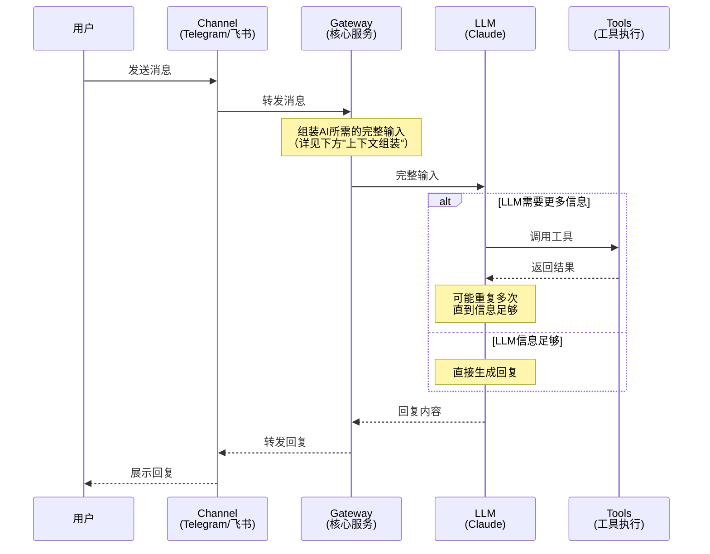

# OpenClaw 工作流程

## 这是什么？

OpenClaw是一个AI助手框架。用户通过聊天软件（如Telegram）发消息，OpenClaw把消息交给AI大模型（如Claude）处理，再把AI的回复发回给用户。

整个过程涉及4个角色：

| 角色 | 是什么 | 做什么 |
|---|---|---|
| Channel | 聊天软件的接口（Telegram/Discord/飞书等） | 负责收发消息 |
| Gateway | OpenClaw的核心服务（1个部署只有1个） | 负责管理对话、组装AI所需的输入、调度定时任务 |
| LLM | AI大模型（如Claude） | 负责理解问题、决定行动、生成回复 |
| Tools | 一组工具（搜索、读写文件、执行命令等） | 负责执行LLM发出的具体操作 |

## 一次对话的完整流程

下面逐步展开每个环节。

---

## 1. Channel — 消息怎么进来、怎么出去

Channel是OpenClaw与聊天软件之间的桥梁。目前支持Telegram、Discord、Signal、WhatsApp、飞书、Slack等。

**收消息时**，Channel把用户发的文字/图片/语音/文件转成统一格式，附上发送者ID、时间戳等信息，交给Gateway。

**发回复时**，Channel把Gateway给的回复内容（文字、图片、文件等）通过聊天软件发给用户。

Channel只是搬运工，不做任何智能处理。

## 2. Gateway — 核心调度中心

Gateway是整个系统的中枢，负责三件事：管理对话、组装输入、调度任务。

### 2.1 管理对话

每个用户（或群聊）对应一个Session（会话）。Session保存了这个对话的所有历史消息。

Session有三种：
- **私聊**：用户和AI的1对1对话
- **群聊**：在群里的对话
- **子agent**：AI为了完成复杂任务，临时创建的独立会话（后面会详细解释）

### 2.2 组装输入（上下文组装）

AI大模型（LLM）本身是无状态的 — 它没有记忆，每次调用都是全新的。要让它"记住"之前聊过什么、知道自己是谁，必须每次都把所有相关信息打包发给它。

这个打包过程叫"上下文组装"，Gateway每次调用LLM前都会做一次，拼装以下三部分：

**第一部分：System Prompt（系统指令）**

告诉LLM"你是谁、你能做什么、有哪些规则"。其中包含了一组Workspace文件的内容：

| 文件 | 内容 | 举例 |
|---|---|---|
| SOUL.md | AI的性格和说话风格 | "你叫Possible，风格直接、不废话" |
| USER.md | 用户的基本信息 | "用户叫Alan，后端工程师，UTC+8" |
| MEMORY.md | AI的长期记忆（手动维护的文件） | "用户在做XX项目，钱包余额16 USDC" |
| AGENTS.md | AI的行为规范 | "敏感操作先问，不要泄露隐私" |
| TOOLS.md | 工具使用备注 | "SSH地址、摄像头名称等" |

这些文件存在服务器磁盘上，每次新对话都会被读取并注入。AI通过读这些文件来"恢复记忆"。

**第二部分：对话历史**

本次Session中所有之前的消息，包括：用户说的话、AI的回复、AI调用工具的过程和结果。全部按时间顺序排列。

这是AI知道"刚才聊了什么"的唯一途径。但这里有一个隐患：对话越长，历史消息越多，而LLM的输入有大小上限（200k token，约15万字）。一旦撑满，就必须压缩历史，压缩就会丢信息。这个问题会在后面[对话越长，AI越"健忘"？](#对话越长ai越健忘)部分详细展开。

**第三部分：当前消息**

用户这次发的新消息。

三部分拼在一起，就是LLM每次收到的完整输入。

### 2.3 调度

Gateway还负责定时触发两类任务：
- **心跳（Heartbeat）**：定期唤醒AI检查是否有事需要处理（如检查邮件、日历等）
- **定时任务（Cron）**：在指定时间触发AI执行某个操作（如每天8点检查市场行情）

### 2.4 回复处理

LLM返回的内容并不总是直接转发给用户。Gateway会先检查：
- 普通文本 → 发给用户
- `NO_REPLY` → 不发送（AI判断不需要回复）
- `HEARTBEAT_OK` → 心跳确认，不发送
- `MEDIA:文件路径` → 发送图片/文件而不是文本

## 3. LLM — AI怎么思考和行动

LLM收到Gateway组装好的完整输入后，开始推理。它会做一个判断：

**"我现在掌握的信息够不够回答这个问题？"**

- 如果**够了**（比如用户问"你好"），直接生成回复文本
- 如果**不够**（比如用户问"服务器跑着吗"），就调用工具去获取信息

工具调用可能发生多次。例如：
1. 先调用 `memory_search` 搜索记忆，找到服务器IP
2. 再调用 `exec` 执行SSH命令检查进程状态
3. 拿到结果后，生成回复："服务器正常运行"

每次工具返回结果后，LLM都会重新判断信息是否足够，直到能给出完整回复。

## 4. Tools — AI的手和脚

LLM本身只能"想"（生成文本），不能"做"。Tools让它能操作外部世界。

### 记忆相关
| 工具 | 做什么 |
|---|---|
| `memory_search` | 在记忆文件中搜索相关内容（语义搜索，不是精确匹配） |
| `memory_get` | 读取记忆文件的指定行 |

这两个工具比较特殊，需要展开说明。

前面提到，MEMORY.md等Workspace文件会自动注入到每次调用中，但**每日笔记（memory/*.md）不会自动注入** — 文件太多，全部塞进去会浪费token。AI需要主动调用`memory_search`去搜索它们。

**什么时候会触发？** 这完全由AI自己判断。System Prompt里有一条规则要求AI"在回答涉及历史决策、偏好、待办等问题前，先搜索记忆文件"。但AI是否遵守、搜什么关键词、搜到的结果是否相关，都不是确定性的。

**语义搜索**的意思是：不需要关键词完全匹配，而是根据含义找相关内容。比如搜"钱包余额"可能匹配到"账户里有16 USDC"。好处是更智能，坏处是可能漏掉相关内容，也可能匹配到不相关的内容。

**典型流程：**
1. 用户问"上次那个bug修了吗？"
2. AI判断这涉及历史信息，调用 `memory_search("bug修复")`
3. 搜索返回：memory/2026-03-01.md 第15行，相似度0.82，内容"修复了登录页白屏问题"
4. AI如果需要更多上下文，调用 `memory_get(path="memory/2026-03-01.md", from=12, lines=10)` 读取前后几行
5. 拿到完整信息后回复用户

**局限性：** 如果AI判断不需要搜索（比如它觉得对话历史里已经有答案），就不会调用。如果搜索的关键词不好，也可能搜不到。这是目前系统中**最不确定的环节**。

### 文件操作
| 工具 | 做什么 |
|---|---|
| `read` | 读取文件内容 |
| `write` | 创建或覆盖文件 |
| `edit` | 精确替换文件中的指定文本 |

### 系统操作
| 工具 | 做什么 |
|---|---|
| `exec` | 执行Shell命令（如 `ls`、`ssh`、`pm2 restart`） |
| `process` | 管理后台运行的命令 |

### 网络操作
| 工具 | 做什么 |
|---|---|
| `web_search` | 搜索引擎查询 |
| `web_fetch` | 抓取网页内容 |
| `browser` | 控制浏览器（打开页面、点击按钮等） |

### 通信操作
| 工具 | 做什么 |
|---|---|
| `message` | 主动发消息、添加反应、删除消息 |
| `sessions_spawn` | 创建子agent（见下方说明） |
| `sessions_send` | 向其他Session发消息 |
| `cron` | 创建定时任务 |

### Node操作（可选，需要额外配对设备）

默认单机部署不涉及Node。当用户将其他设备（手机、树莓派、远程服务器等）与Gateway配对后，AI就可以通过`nodes`工具远程操控这些设备。

| 工具 | 做什么 |
|---|---|
| `nodes` | 向配对的Node设备发指令：拍照、录屏、获取定位、执行远程命令等 |

**工作方式：** AI发指令 → Gateway转发给目标Node → Node执行并返回结果（照片、位置、命令输出等） → Gateway交给AI处理。

### 子agent是什么？

当任务比较复杂（比如"给项目加一个新功能"），AI可以创建一个**子agent** — 一个独立的Session，专门执行这个任务。

子agent拥有：
- 独立的对话上下文（不会占用主Session的空间）
- 对文件系统的完整访问权（和主Session共享同一台服务器）

子agent没有：
- 主Session的对话历史（它不知道你之前聊了什么，只知道任务描述）

子agent完成后，会把结果摘要发回主Session。

---

## 对话越长，AI越"健忘"？

前面提到，对话历史会随着聊天不断增长，最终撑满200k token的上限。这时候Gateway会启动压缩，而压缩必然意味着信息丢失。

### Compaction（压缩）

当历史接近上限时，Gateway执行压缩：

1. **先让AI把重要内容写入文件** — 防止压缩后丢失关键信息
2. **把所有历史消息压缩成一段摘要** — 比如100条消息变成一段500字的总结
3. **用摘要替代原始历史** — 释放空间，对话可以继续

### 衰减过程

| 压缩次数 | 上下文质量 | AI的表现 |
|---|---|---|
| 0次 | 完整原文 | 记得所有对话细节 |
| 1次 | 较好 | 大部分细节保留在摘要中 |
| 2-3次 | 一般 | 只剩关键结论，过程细节丢失 |
| 多次 | 较差 | 摘要被反复压缩，可能遗忘早期约定、重复已讨论的问题 |

**这是当前架构的固有缺陷** — 对话越长，AI的"记忆"越模糊。

### 怎么缓解？

| 方法 | 原理 | 效果 |
|---|---|---|
| 写入文件 | 重要内容写入MEMORY.md等文件，不依赖对话历史 | ⭐⭐⭐ 最关键 |
| memory_search | 回答前搜索文件，召回遗忘的信息 | ⭐⭐ 能补回部分 |
| 开新Session | 对话太长时重新开始。新Session从MEMORY.md等文件加载信息。虽然MEMORY.md也是摘要，但和compaction有本质区别：compaction是不可逆的有损压缩（原始对话被替换，无法找回），而MEMORY.md是增量维护的索引（原始的每日笔记memory/*.md还在磁盘上，随时可以用memory_search搜索回来）。**注意：目前OpenClaw不会自动开新session**，需要用户手动触发（如重置对话）。这是一个潜在的改进点 | ⭐⭐⭐ 上下文质量最高 |
| 用子agent | 复杂任务用独立Session，不占主Session空间 | ⭐⭐ 延缓膨胀 |

### 本质

> **对话历史 = 短期记忆**，会不断被压缩遗忘
>
> **文件 = 长期记忆**，永久保存在磁盘上
>
> 对话质量 = 短期记忆的剩余空间 + 长期记忆的完整度。两者配合才能维持一致性。

---

## 记忆层次总结

| 层 | 存在哪里 | 什么时候消失 | 怎么访问 |
|---|---|---|---|
| 对话历史 | 内存 | 压缩时被摘要替代 | 自动注入（Gateway每次调用LLM前拼装） |
| Workspace文件（SOUL/USER/MEMORY等） | 磁盘 | 不会消失，除非手动删除 | 同上，也是自动注入 |
| 每日笔记（memory/*.md） | 磁盘 | 不会消失 | 需要AI主动调用memory_search搜索 |
| 其他文件（代码、文档等） | 磁盘 | 不会消失 | 需要AI主动调用read读取 |

前两层是**自动的** — AI不需要做任何事，Gateway会把它们塞进每次调用的输入里。后两层是**被动的** — 只有AI主动去搜索/读取时才能获得。

## 关键限制

1. **AI没有真正的记忆** — 每次对话从零开始，全靠文件恢复上下文
2. **输入窗口有限（200k token）** — 聊多了必须压缩，压缩就会丢信息
3. **语义搜索不完美** — memory_search根据含义匹配，可能漏掉相关内容
4. **工具调用有延迟** — 每次约1-5秒
5. **子agent不共享对话** — 只知道任务描述，不知道之前聊了什么
6. **没写到文件就不算记住** — AI说"我记住了"但没写文件，下次session就忘了
