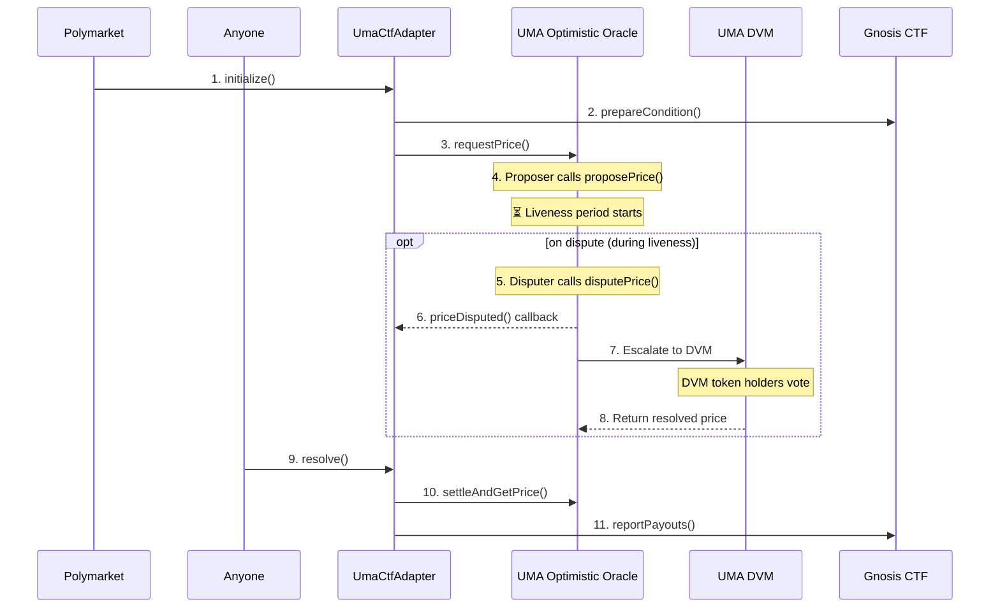

# Introduction

Polymarket uses [UMA's Optimistic Oracle](https://docs.uma.xyz/protocol-overview/how-does-umas-oracle-work) for market resolution. The [UmaCtfAdapter](https://github.com/Polymarket/uma-ctf-adapter/blob/10dd8829d710ed9c2541b4196b463ad0c90546fc/src/UmaCtfAdapter.sol) bridges UMA with [Gnosis Conditional Tokens](https://github.com/gnosis/conditional-tokens-contracts).

# Contract Architecture



1. **Polymarket** calls UmaCtfAdapter [`initialize()`](https://github.com/Polymarket/uma-ctf-adapter/blob/10dd8829d710ed9c2541b4196b463ad0c90546fc/src/UmaCtfAdapter.sol#L87) — must be called before trading
2. **UmaCtfAdapter** [calls](https://github.com/Polymarket/uma-ctf-adapter/blob/10dd8829d710ed9c2541b4196b463ad0c90546fc/src/UmaCtfAdapter.sol#L109) CTF [`prepareCondition()`](https://github.com/gnosis/conditional-tokens-contracts/blob/eeefca66eb46c800a9aaab88db2064a99026fde5/contracts/ConditionalTokens.sol#L65) — without this, [`splitPosition()`](https://github.com/gnosis/conditional-tokens-contracts/blob/eeefca66eb46c800a9aaab88db2064a99026fde5/contracts/ConditionalTokens.sol#L114) reverts
3. **UmaCtfAdapter** [calls](https://github.com/Polymarket/uma-ctf-adapter/blob/10dd8829d710ed9c2541b4196b463ad0c90546fc/src/UmaCtfAdapter.sol#L363) UMA OO [`requestPrice()`](https://github.com/UMAprotocol/protocol/blob/8cecdccddd06c0cc24dc945e7b8b9180ab02d71f/packages/core/contracts/optimistic-oracle-v2/implementation/OptimisticOracleV2.sol#L120)
4. **Proposer** calls UMA OO [`proposePrice()`](https://github.com/UMAprotocol/protocol/blob/8cecdccddd06c0cc24dc945e7b8b9180ab02d71f/packages/core/contracts/optimistic-oracle-v2/implementation/OptimisticOracleV2.sol#L360) — starts liveness period
5. **Disputer** calls UMA OO [`disputePrice()`](https://github.com/UMAprotocol/protocol/blob/8cecdccddd06c0cc24dc945e7b8b9180ab02d71f/packages/core/contracts/optimistic-oracle-v2/implementation/OptimisticOracleV2.sol#L458) (optional, during liveness)
6. **UMA OO** [calls](https://github.com/UMAprotocol/protocol/blob/8cecdccddd06c0cc24dc945e7b8b9180ab02d71f/packages/core/contracts/optimistic-oracle-v2/implementation/OptimisticOracleV2.sol#L445) UmaCtfAdapter [`priceDisputed()`](https://github.com/Polymarket/uma-ctf-adapter/blob/10dd8829d710ed9c2541b4196b463ad0c90546fc/src/UmaCtfAdapter.sol#L162) callback (on dispute)
7. **UMA OO** [escalates](https://github.com/UMAprotocol/protocol/blob/8cecdccddd06c0cc24dc945e7b8b9180ab02d71f/packages/core/contracts/optimistic-oracle-v2/implementation/OptimisticOracleV2.sol#L417) to DVM for token holder vote (on dispute)
8. **UMA OO** [gets](https://github.com/UMAprotocol/protocol/blob/8cecdccddd06c0cc24dc945e7b8b9180ab02d71f/packages/core/contracts/optimistic-oracle-v2/implementation/OptimisticOracleV2.sol#L602) resolved price from DVM (after vote)
9. **Anyone** calls UmaCtfAdapter [`resolve()`](https://github.com/Polymarket/uma-ctf-adapter/blob/10dd8829d710ed9c2541b4196b463ad0c90546fc/src/UmaCtfAdapter.sol#L128) (after liveness expires or DVM resolves)
10. **UmaCtfAdapter** [calls](https://github.com/Polymarket/uma-ctf-adapter/blob/10dd8829d710ed9c2541b4196b463ad0c90546fc/src/UmaCtfAdapter.sol#L417) UMA OO [`settleAndGetPrice()`](https://github.com/UMAprotocol/protocol/blob/8cecdccddd06c0cc24dc945e7b8b9180ab02d71f/packages/core/contracts/optimistic-oracle-v2/implementation/OptimisticOracleV2.sol#L477) (resolution)
11. **UmaCtfAdapter** [calls](https://github.com/Polymarket/uma-ctf-adapter/blob/10dd8829d710ed9c2541b4196b463ad0c90546fc/src/UmaCtfAdapter.sol#L435) CTF [`reportPayouts()`](https://github.com/gnosis/conditional-tokens-contracts/blob/eeefca66eb46c800a9aaab88db2064a99026fde5/contracts/ConditionalTokens.sol#L78) (resolution)

| Contract | Purpose |
|----------|---------|
| [Gnosis CTF](https://github.com/gnosis/conditional-tokens-contracts) | Holds positions, mint/merge/redeem |
| [UmaCtfAdapter](https://github.com/Polymarket/uma-ctf-adapter/blob/10dd8829d710ed9c2541b4196b463ad0c90546fc/src/UmaCtfAdapter.sol) | Resolution via UMA |

UmaCtfAdapter is a **singleton contract** — deployed once, shared by all markets:

| Version | Address |
|---------|---------|
| [V1](https://polygonscan.com/address/0x71392E133063CC0D16F40E1F9B60227404Bc03f7) | `0x71392E133063CC0D16F40E1F9B60227404Bc03f7` |
| [V2](https://polygonscan.com/address/0x6A9D222616C90FcA5754cd1333cFD9b7fb6a4F74) | `0x6A9D222616C90FcA5754cd1333cFD9b7fb6a4F74` |
| [V3](https://polygonscan.com/address/0x2F5e3684cb1F318ec51b00Edba38d79Ac2c0aA9d) | `0x2F5e3684cb1F318ec51b00Edba38d79Ac2c0aA9d` |

`initialize()` is technically permissionless, but `questionID = keccak256(msg.sender, ancillaryData)` — different callers get different questionIDs. Polymarket's markets only use questionIDs created by their own address.

# Resolution Details

## UmaCtfAdapter.resolve() calls CTF

```solidity
function _resolve(bytes32 questionID, QuestionData storage questionData) internal {
    uint256[] memory payouts = getExpectedPayouts(questionID);
    questionData.resolved = true;
    ctf.reportPayouts(questionID, payouts);
}
```

## CTF.reportPayouts() stores outcome

```solidity
function reportPayouts(bytes32 questionId, uint[] calldata payouts) external {
    // conditionId = keccak256(oracle, questionId, outcomeSlotCount)
    bytes32 conditionId = CTHelpers.getConditionId(msg.sender, questionId, payouts.length);
    // stores payouts: [1,0] for YES, [0,1] for NO
    payoutNumerators[conditionId] = payouts;
    payoutDenominator[conditionId] = sum(payouts);
}
```

## Users call CTF.redeemPositions()

```solidity
function redeemPositions(...) external {
    uint den = payoutDenominator[conditionId];
    require(den > 0, "result for condition not received yet");
    // Burns YES/NO tokens, transfers USDC based on payout ratios
}
```

If user redeems before resolution → reverts with "result for condition not received yet".

## Outcome Mapping

| UMA Price | Meaning | CTF Payouts [YES, NO] | Redemption |
|-----------|---------|----------------------|------------|
| 0 | NO wins | [0, 1] | NO → $1, YES → $0 |
| 1e18 | YES wins | [1, 0] | YES → $1, NO → $0 |
| 0.5e18 | Unknown/Invalid | [1, 1] | Both → $0.50 |

Note: UMA uses 18 decimals, so 1e18 = 1 in human terms.

# Dispute Handling

- **First dispute** → `priceDisputed()` callback resets and requests new price (avoids slow DVM)
- **Second dispute** → escalates to DVM, token holders vote on correct price (used for both bond winner and market resolution)

# Safety Mechanisms

- **Admin controls**: [`flag()`](https://github.com/Polymarket/uma-ctf-adapter/blob/10dd8829d710ed9c2541b4196b463ad0c90546fc/src/UmaCtfAdapter.sol#L208) pauses resolution, [`reset()`](https://github.com/Polymarket/uma-ctf-adapter/blob/10dd8829d710ed9c2541b4196b463ad0c90546fc/src/UmaCtfAdapter.sol#L240) requests new price
